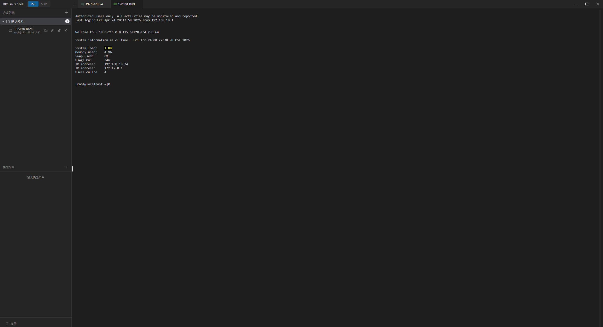
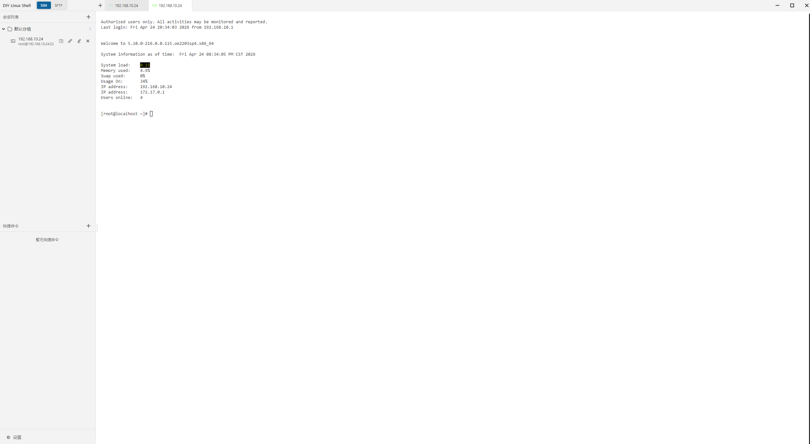
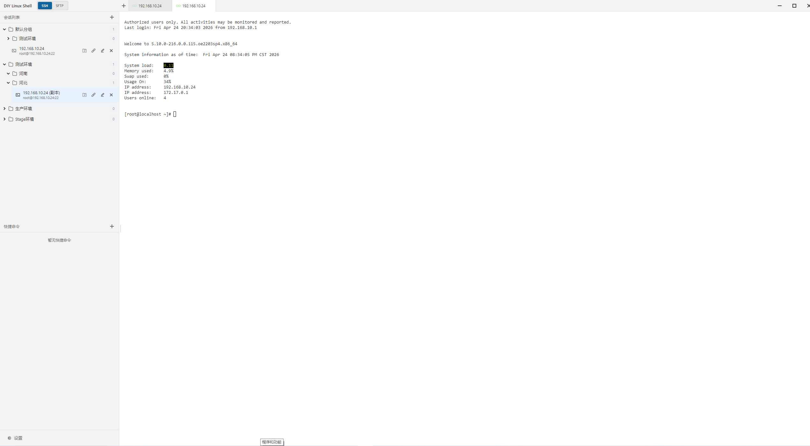
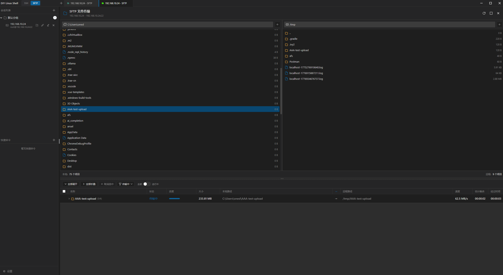
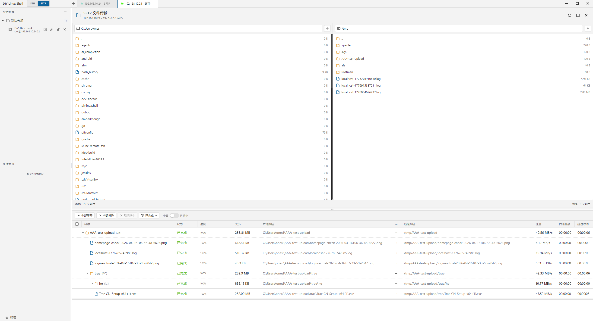
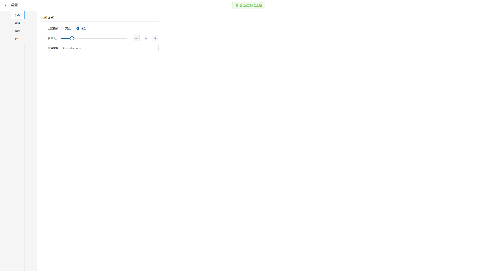

# DIY-Linux-Shell

[](https://nodejs.org/)
[](https://www.electronjs.org/)
[](https://vuejs.org/)
[](https://www.typescriptlang.org/)
[](LICENSE)

一款现代化的 SSH 终端管理工具，基于 Electron + Vue 3 + TypeScript 构建。提供多会话管理、SFTP 文件传输、终端分屏等核心功能，致力于成为开发者和运维人员的得力助手。

## 📢 产品动态

> ✅ **目前已通过全部基础测试**，各个平台的安装包将相继上传...

## ✨ 功能特性

### 终端管理
- **多 Tab 会话** — 同时管理多个 SSH 连接，支持标签页切换
- **xterm.js 终端** — 基于 xterm.js 的高性能终端模拟器，支持自定义字体、光标样式、滚动缓冲区
- **会话分组** — 支持多级嵌套分组，灵活组织连接（最多 5 级嵌套）
- **SSH/SFTP 一键切换** — 终端和 SFTP 文件传输无缝切换，多标签页管理

### SFTP 文件传输
- **多 Tab 支持** — SFTP 会话支持多标签页，与 SSH 终端共享标签栏
- **双栏浏览器** — 本地/远程文件并排浏览
- **批量上传下载** — 支持文件和文件夹的批量传输，实时进度可视化
- **树形进度展示** — 文件夹传输时以树形结构展示每个文件的传输状态

### 其他功能
- **主题切换** — 深色/浅色主题，跟随系统或手动切换
- **数据持久化** — electron-store 持久化存储会话、配置等数据
- **自动重连** — 可配置的断线自动重连策略
- **跨平台支持** — 一次开发，多端运行，完美支持 Windows、Linux、macOS 三大主流操作系统

## 项目结构

```
diy-linux-shell/
├── src/
│   ├── main/                  # 主进程
│   │   ├── services/          # 主进程服务层
│   │   │   ├── ssh-manager.ts # SSH 连接管理
│   │   │   ├── sftp.ts        # SFTP 服务
│   │   │   ├── store.ts       # 数据持久化存储
│   │   │   └── crypto.ts      # 加密工具
│   │   └── index.ts           # 主进程入口
│   ├── preload/               # 预加载脚本（IPC 桥接）
│   └── renderer/              # 渲染进程（Vue 应用）
│       ├── api/               # IPC API 封装
│       ├── components/        # 组件库
│       │   ├── terminal/      # 终端组件（xterm、Tab、SFTP）
│       │   ├── session/       # 会话管理组件
│       │   └── common/        # 通用组件
│       ├── stores/            # Pinia 状态管理
│       ├── views/             # 页面视图
│       └── router/            # Vue Router
├── resources/                 # 静态资源（图标等）
├── electron.vite.config.ts    # electron-vite 配置
├── package.json
└── tsconfig.json
```

## 环境要求

- **Node.js** >= 20.x（推荐 LTS 版本）
- **npm** >= 9.x（随 Node.js 安装）
- **操作系统**：Windows 10+ / macOS / Linux

> ⚠️ Windows 用户建议使用 PowerShell 或 Git Bash 运行命令。

## 快速开始

### 前置准备

#### 1. 克隆仓库

```bash
git clone https://gitee.com/oneslideicywater/diy-linux-shell.git
cd diy-linux-shell
```

#### 2. 安装依赖

```bash
npm install
```

安装完成后自动触发 `postinstall` 脚本，下载 Electron 二进制文件。

---

### 开发者模式

适合开发、调试和贡献代码。

#### 启动开发服务器

```bash
npm run dev
```

启动后支持热重载，修改代码即可看到效果。

---

### 生产打包模式

适合最终用户使用。

#### 构建生产版本

```bash
npm run build
```

输出目录为 `out/`。

#### 多平台打包

构建完成后，使用以下命令打包成可执行文件：

| 平台 | 命令 | 输出格式 |
|------|------|----------|
| Windows | `npm run package:win` | NSIS (.exe), Portable (.exe) |
| Linux | `npm run package:linux` | AppImage, .deb, .rpm |
| macOS | `npm run package:mac` | DMG (.dmg) |
| 全平台 | `npm run package:all` | 以上所有格式 |

详细打包说明见 [多平台打包](#多平台打包) 章节。

## 多平台打包

### Windows

```bash
npm run package:win
```

**生成产物：**
- `*.exe` — NSIS 安装包（含安装向导）
- `*.exe` — Portable 便携版（免安装）

**输出目录：** `release/`

> 💡 **提示：** 如果 `npm run package:win` 打包不成功，可以使用自动化脚本打包：
> ```powershell
> powershell.exe -ExecutionPolicy Bypass -File scripts\package-clean.ps1
> ```

### Linux

```bash
npm run package:linux
```

**生成产物：**
- `*.AppImage` — 通用 Linux 包
- `*.deb` — Debian/Ubuntu 系列
- `*.rpm` — RHEL/Fedora 系列

**输出目录：** `release/`

### macOS

```bash
npm run package:mac
```

**生成产物：**
- `*.dmg` — macOS 磁盘映像（支持 x64 + Apple Silicon）

**输出目录：** `release/`

### 全平台一次性打包

```bash
npm run package:all
```

> 📌 **注意：** 跨平台打包需要在对应操作系统上执行。如需在单一机器上打包全平台，请配置 Docker 或 CI 流水线。

### 快速参考表

| 平台 | 命令 | 输出格式 |
|------|------|----------|
| Windows | `npm run package:win` | NSIS (.exe), Portable (.exe) |
| Linux | `npm run package:linux` | AppImage, .deb, .rpm |
| macOS | `npm run package:mac` | DMG (.dmg) |
| 全平台 | `npm run package:all` | 以上所有格式 |

## 开发指南

### 常用命令

| 命令 | 说明 |
|------|------|
| `npm run dev` | 启动开发服务器（HMR） |
| `npm run build` | 构建生产版本 |
| `npm run preview` | 预览构建结果 |
| `npm run lint` | ESLint 代码检查与修复 |
| `npm run typecheck` | TypeScript 类型检查 |
| `npm run test` | 运行单元测试（Vitest） |
| `npm run test:e2e` | 运行 E2E 测试（Playwright） |
| `npm run test:all` | 运行全部测试 |
| `npm run format` | Prettier 代码格式化 |

### 数据存储路径

| 环境 | 数据存储位置 |
|------|-------------|
| 开发模式 | `<项目根目录>/data/` |
| 生产模式（打包后） | `<用户主目录>/.diylinuxshell/` |

### 代码规范

- 使用 TypeScript 编写，变量声明必须显式指定类型
- 业务逻辑放在 Service 层，IPC 层只做薄封装
- 所有函数必须添加注释说明用途
- 使用 ES Module (`import`) 导入模块，禁止使用 `require`
- 使用 Node.js `path` 模块处理文件路径，禁止字符串拼接
- 修改函数后需要更新对应的 `digest.md`

## 测试

项目采用三层测试体系：

1. **单元测试 (Vitest)** — 覆盖核心业务逻辑
2. **集成测试 (Vitest)** — 验证模块间协作
3. **E2E 测试 (Playwright)** — 模拟真实用户操作流程

```bash
# 运行全部测试
npm run test:all

# 仅运行单元测试
npm run test:unit

# 仅运行 E2E 测试
npm run test:e2e

# E2E 测试 UI 模式（可视化调试）
npm run test:e2e:ui
```

## CI/CD

项目使用 GitHub Actions 实现自动化流水线（[`.github/workflows/build.yml`](.github/workflows/build.yml)）：

- **push / PR** → 自动运行 lint + 类型检查 + 单元测试 + 集成测试
- **Tag 推送 (`v*`)** → 自动构建三平台安装包并创建 GitHub Release
- **E2E 测试** → 在 PR 和 main 分支上自动执行

## 截图

### 主界面



### 会话分组


### SFTP 文件传输



### 主题设置


## 贡献指南

欢迎贡献代码！请遵循以下流程：

1. Fork 本仓库
2. 创建特性分支 (`git checkout -b feature/amazing-feature`)
3. 提交更改 (`git commit -m 'Add amazing feature'`)
4. 推送到分支 (`git push origin feature/amazing-feature`)
5. 创建 Pull Request

提交前请确保：
- `npm run typecheck` 通过
- `npm run lint` 无错误
- 相关测试用例通过

## License

本项目采用 [Apache 2.0 License](LICENSE) 开源协议。
