# 自研终端管理工具 架构设计文档

## 1. 文档信息

| 项目 | 内容 |
|------|------|
| 产品名称 | DIY-Linux-Shell（自研终端管理工具） |
| 文档版本 | V1.0 |
| 创建日期 | 2026-03-29 |
| 文档状态 | 草稿 |

---

## 2. 技术选型

### 2.1 技术栈总览

| 层级 | 技术选型 | 选型理由 |
|------|----------|----------|
| 前端框架 | Electron + Vue 3 | 跨平台能力强，生态成熟，开发效率高 |
| UI组件库 | Element Plus | 组件丰富，文档完善，与Vue 3深度集成 |
| 状态管理 | Pinia | Vue 3官方推荐，轻量级，TypeScript友好 |
| 终端模拟 | xterm.js | 功能强大，VS Code同款，社区活跃 |
| SSH连接 | ssh2 (node-ssh) | Node.js最成熟的SSH库，功能完整 |
| 构建工具 | Vite | 极速热更新，现代化构建工具 |
| 编程语言 | TypeScript | 类型安全，提升代码质量和可维护性 |
| 数据存储 | electron-store | 轻量级JSON存储，无需编译，跨平台兼容 |

### 2.2 技术架构图

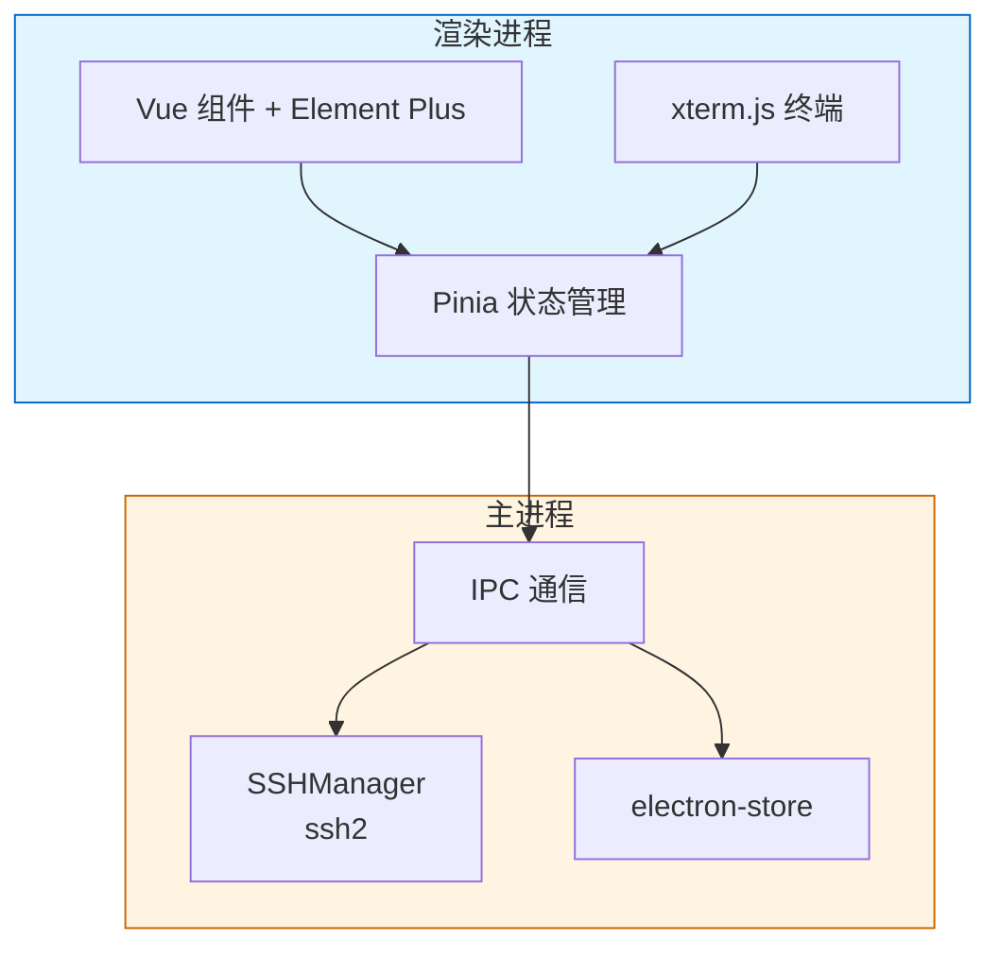

---

## 3. 系统架构设计

### 3.1 整体架构

本项目采用 **Electron 多进程架构**，主要包含：

- **主进程 (Main Process)**：负责窗口管理、SSH连接管理、数据存储、系统级操作
- **渲染进程 (Renderer Process)**：负责用户界面渲染、用户交互处理
- **IPC通信**：主进程与渲染进程之间的通信桥梁

### 3.2 进程架构图

#### 3.2.1 整体架构概览

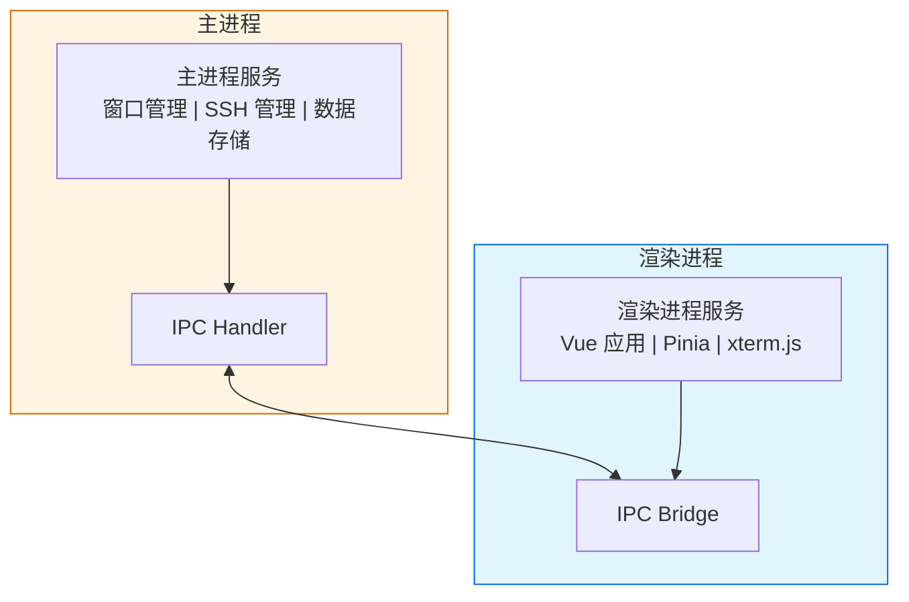

#### 3.2.2 主进程架构

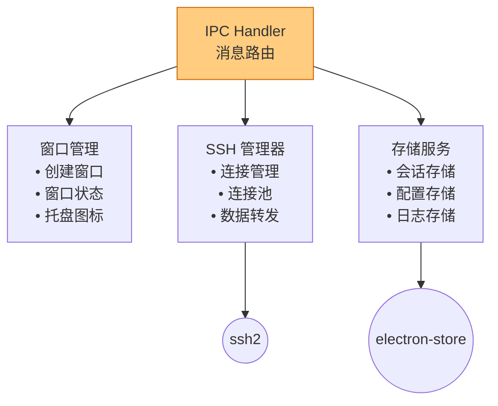

#### 3.2.3 渲染进程架构

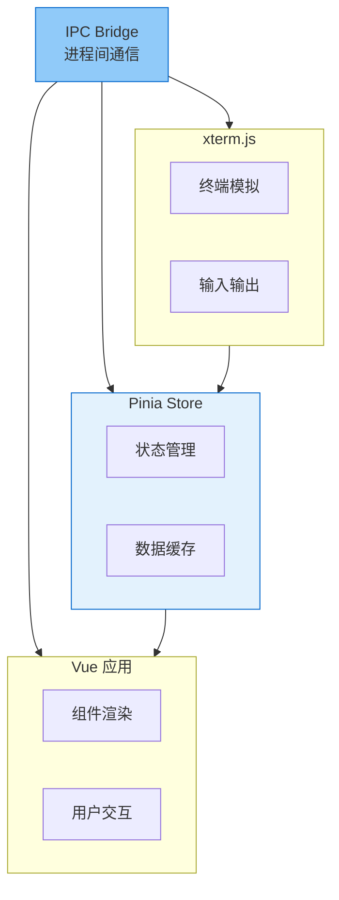

---

## 4. 模块设计

### 4.1 目录结构

```bash
diy-linux-shell/
├── package.json                    # 项目配置文件
├── electron.vite.config.ts         # Electron 构建配置
├── tsconfig.json                   # TypeScript 配置
├── playwright.config.ts            # Playwright E2E 测试配置
├── vitest.config.ts                # Vitest 单元测试配置
│
├── src/                            # 源代码目录
│   ├── main/                       # 主进程代码
│   ├── renderer/                   # 渲染进程代码
│   ├── preload/                    # 预加载脚本
│   └── shared/                     # 共享代码
│
├── e2e/                            # E2E 测试 (Playwright)
│   ├── config/                     # 测试配置
│   ├── helpers/                    # 测试辅助工具
│   ├── app/                        # 应用测试
│   ├── connection/                 # 连接测试
│   ├── context-menu/               # 右键菜单测试
│   ├── debug/                      # 调试测试
│   ├── empty-state/                # 空状态测试
│   ├── layout/                     # 布局测试
│   ├── session/                    # 会话测试
│   ├── session-form/               # 会话表单测试
│   ├── session-group/              # 会话组测试
│   ├── session-list/               # 会话列表测试
│   ├── settings/                   # 设置测试
│   ├── sftp/                       # SFTP 测试
│   └── terminal/                   # 终端测试
│
├── tests/                          # 单元测试和集成测试 (Vitest)
│   └── integration/                # 集成测试
│
├── docs/                           # 文档
│   ├── bugs/                       # Bug 记录
│   ├── plan/                       # 各阶段计划
│   └── wiki/                       # 技术维基
│
├── resources/                      # 应用资源
├── .github/                        # GitHub 配置
│   └── workflows/                  # GitHub Actions 工作流
│
└── .trae/                          # Trae IDE 配置
    ├── rules/                      # 项目规则
    └── skills/                     # 技能配置
```

### 4.2 核心模块设计

#### 4.2.1 SSH管理器 (SSHManager)

```typescript
/**
 * SSH连接管理器
 * 负责管理所有SSH连接的生命周期
 */
class SSHManager {
  private connections: Map<string, SSHConnection>;
  
  // 创建新的SSH连接
  async connect(sessionId: string, config: SSHConfig): Promise<void>;
  
  // 断开指定连接
  async disconnect(sessionId: string): Promise<void>;
  
  // 向终端发送数据
  write(sessionId: string, data: string): void;
  
  // 调整终端大小
  resize(sessionId: string, cols: number, rows: number): void;
  
  // 获取连接状态
  getStatus(sessionId: string): ConnectionStatus;
  
  // 执行命令
  async exec(sessionId: string, command: string): Promise<string>;
}
```

#### 4.2.2 数据存储服务 (StoreService)

```typescript
/**
 * 数据存储服务
 * 使用 electron-store 存储应用数据 (JSON格式)
 */
import Store from 'electron-store'

// 定义存储数据结构
interface StoreSchema {
  sessions: Session[]
  commands: Command[]
  config: AppConfig
  groups: SessionGroup[]
  commandGroups: CommandSnippetGroup[]
  history: HistoryRecord[]
}

class StoreService {
  private store: Store<StoreSchema>
  
  constructor() {
    this.store = new Store<StoreSchema>({
      name: 'config',
      defaults: {
        sessions: [],
        commands: [],
        config: this.getDefaultConfig(),
        groups: [],
        commandGroups: [],
        history: []
      }
    })
  }
  
  // 会话CRUD操作
  createSession(session: Session): Session
  getSession(id: string): Session | undefined
  updateSession(id: string, data: Partial<Session>): Session
  deleteSession(id: string): void
  listSessions(): Session[]
  
  // 命令片段CRUD操作
  createCommand(command: Command): Command
  getCommand(id: string): Command | undefined
  updateCommand(id: string, data: Partial<Command>): Command
  deleteCommand(id: string): void
  listCommands(): Command[]
  
  // 配置管理
  getConfig(): AppConfig
  updateConfig(config: Partial<AppConfig>): AppConfig
  
  // 数据导入导出
  exportData(): string
  importData(json: string): void
}
```

**存储位置：**
- Windows: `%APPDATA%\diy-linux-shell\config.json`
- Linux: `~/.config/diy-linux-shell/config.json`
- macOS: `~/Library/Application Support/diy-linux-shell/config.json`
```

#### 4.2.3 加密服务 (CryptoService)

```typescript
/**
 * 加密服务
 * 负责敏感数据的加密和解密
 */
class CryptoService {
  // 加密数据
  encrypt(plaintext: string): string;
  
  // 解密数据
  decrypt(ciphertext: string): string;
  
  // 生成密钥对
  generateKeyPair(): KeyPair;
  
  // 验证密码
  verifyPassword(password: string, hash: string): boolean;
}
```

### 4.3 IPC通信设计

#### 4.3.1 IPC通道定义

```typescript
// 共享常量 - IPC通道名称
export const IPC_CHANNELS = {
  // 会话管理
  SESSION_CREATE: 'session:create',
  SESSION_UPDATE: 'session:update',
  SESSION_DELETE: 'session:delete',
  SESSION_LIST: 'session:list',
  SESSION_GET: 'session:get',
  
  // 终端操作
  TERMINAL_CONNECT: 'terminal:connect',
  TERMINAL_DISCONNECT: 'terminal:disconnect',
  TERMINAL_WRITE: 'terminal:write',
  TERMINAL_RESIZE: 'terminal:resize',
  TERMINAL_DATA: 'terminal:data',      // 主进程向渲染进程发送数据
  
  // 配置管理
  CONFIG_GET: 'config:get',
  CONFIG_UPDATE: 'config:update',
  
  // 命令片段
  COMMAND_CREATE: 'command:create',
  COMMAND_UPDATE: 'command:update',
  COMMAND_DELETE: 'command:delete',
  COMMAND_LIST: 'command:list',
} as const;
```

#### 4.3.2 IPC 通信流程

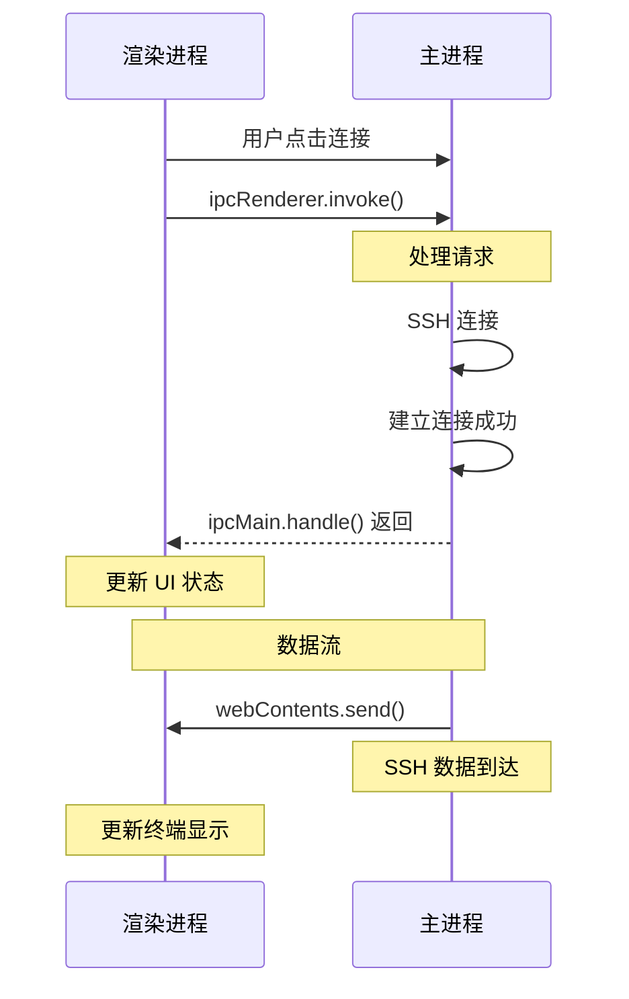

---

## 5. 数据流设计

### 5.1 会话连接数据流


### 5.2 状态管理数据流

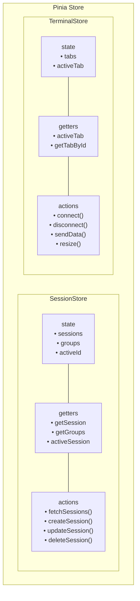

---

## 6. 组件设计

### 6.1 组件层次结构

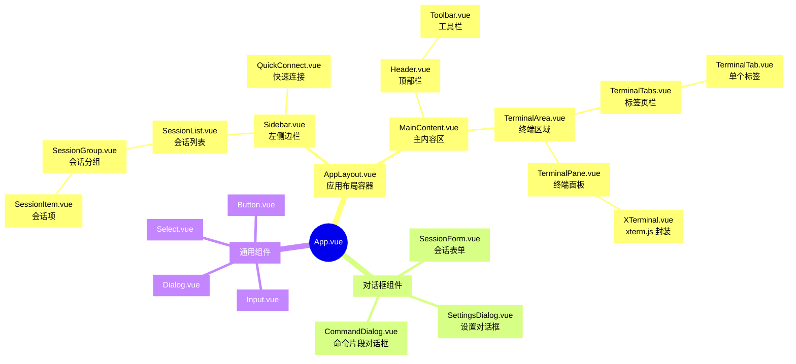

### 6.2 核心组件接口设计

#### 6.2.1 XTerminal 组件

```vue
<script setup lang="ts">
/**
 * XTerminal 组件
 * 封装 xterm.js，提供终端显示和交互功能
 */
import { ref, onMounted, onUnmounted, watch } from 'vue'
import { Terminal } from 'xterm'
import { FitAddon } from 'xterm-addon-fit'
import { WebLinksAddon } from 'xterm-addon-web-links'

interface Props {
  sessionId: string
  fontSize?: number
  fontFamily?: string
  theme?: TerminalTheme
}

interface Emits {
  (e: 'ready'): void
  (e: 'resize', size: { cols: number; rows: number }): void
}

const props = withDefaults(defineProps<Props>(), {
  fontSize: 14,
  fontFamily: 'Consolas, Monaco, monospace'
})

const emit = defineEmits<Emits>()

// 终端实例
const terminalRef = ref<HTMLElement>()
let terminal: Terminal
let fitAddon: FitAddon

// 初始化终端
const initTerminal = () => { /* ... */ }

// 处理输入
const handleInput = (data: string) => { /* ... */ }

// 处理调整大小
const handleResize = () => { /* ... */ }

// 写入数据
const write = (data: string) => { /* ... */ }

// 暴露方法给父组件
defineExpose({ write, resize: handleResize })
</script>
```

#### 6.2.2 SessionList 组件

```vue
<script setup lang="ts">
/**
 * SessionList 组件
 * 显示会话列表，支持分组、搜索、右键菜单
 */
import { ref, computed } from 'vue'
import { useSessionStore } from '@/stores/session'

interface Props {
  searchKeyword?: string
}

const props = defineProps<Props>()
const sessionStore = useSessionStore()

// 过滤后的会话列表
const filteredSessions = computed(() => {
  if (!props.searchKeyword) {
    return sessionStore.sessions
  }
  return sessionStore.sessions.filter(s => 
    s.name.includes(props.searchKeyword) ||
    s.host.includes(props.searchKeyword)
  )
})

// 连接会话
const handleConnect = (session: Session) => { /* ... */ }

// 编辑会话
const handleEdit = (session: Session) => { /* ... */ }

// 删除会话
const handleDelete = (session: Session) => { /* ... */ }
</script>
```

---

## 7. 安全设计

### 7.1 密码存储安全

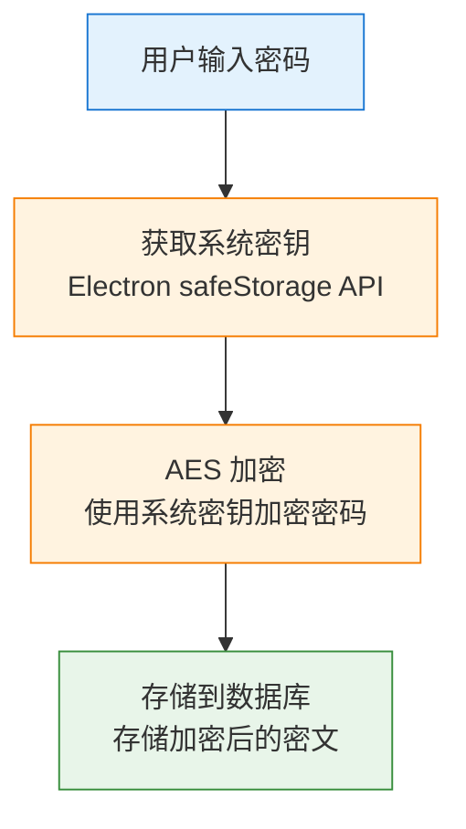

### 7.2 密钥文件安全

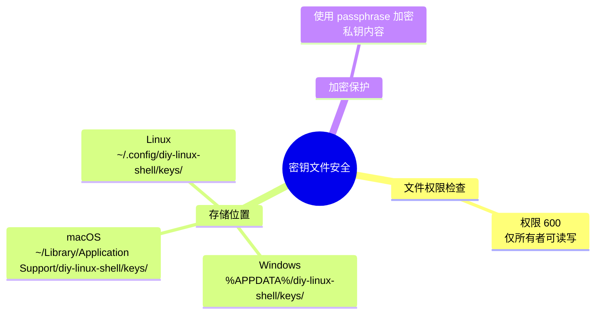

### 7.3 IPC 通信安全

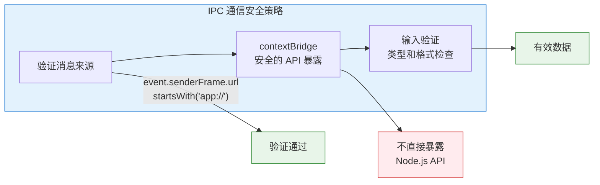

---

## 8. 性能优化设计

### 8.1 终端渲染优化

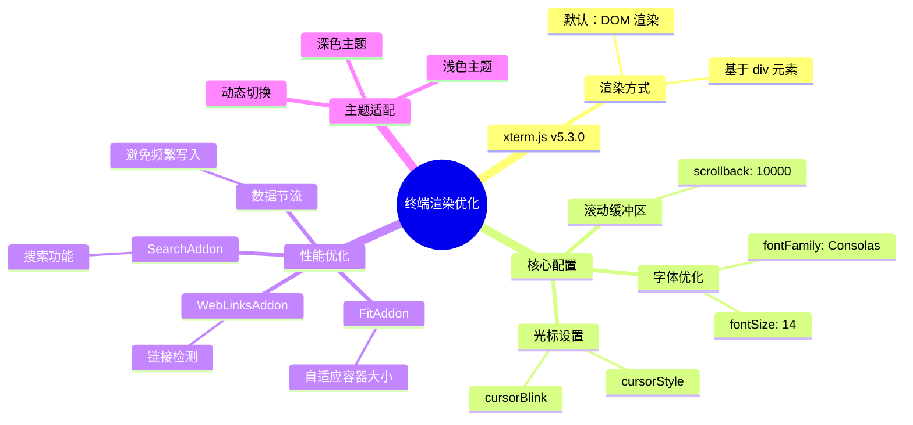

### 8.2 数据存储优化

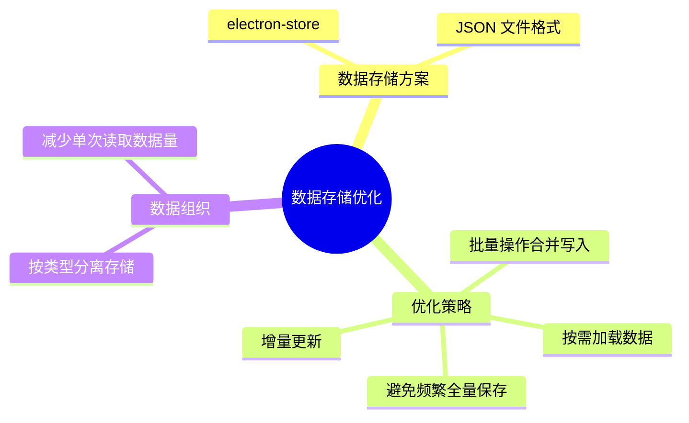

### 8.3 内存管理

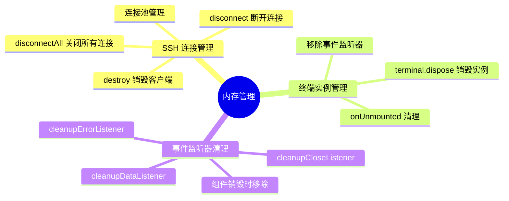

---

## 9. 错误处理设计

### 9.1 错误类型定义

```typescript
/**
 * 应用错误类型
 */
enum ErrorCode {
  // 连接错误 1000-1999
  CONNECTION_FAILED = 1001,
  CONNECTION_TIMEOUT = 1002,
  AUTH_FAILED = 1003,
  CONNECTION_LOST = 1004,
  
  // 数据错误 2000-2999
  DATA_NOT_FOUND = 2001,
  DATA_INVALID = 2002,
  
  // 系统错误 3000-3999
  FILE_NOT_FOUND = 3001,
  PERMISSION_DENIED = 3002,
  UNKNOWN_ERROR = 9999
}

/**
 * 应用错误类
 */
class AppError extends Error {
  code: ErrorCode
  details?: Record<string, unknown>
  
  constructor(code: ErrorCode, message: string, details?: Record<string, unknown>) {
    super(message)
    this.code = code
    this.details = details
  }
}
```

### 9.2 错误处理流程

```
┌─────────────────────────────────────────────────────────────────┐
│                       错误处理流程                               │
│                                                                  │
│  错误发生                                                        │
│       │                                                          │
│       ▼                                                          │
│  ┌─────────────┐                                                │
│  │ 捕获错误     │                                                │
│  └─────────────┘                                                │
│       │                                                          │
│       ▼                                                          │
│  ┌─────────────┐      ┌─────────────┐                          │
│  │ 判断错误类型 │─────►│ 业务错误    │                          │
│  └─────────────┘      └─────────────┘                          │
│       │                      │                                   │
│       │                      ▼                                   │
│       │              ┌─────────────┐                            │
│       │              │ 显示用户提示 │                            │
│       │              └─────────────┘                            │
│       │                      │                                   │
│       ▼                      ▼                                   │
│  ┌─────────────┐      ┌─────────────┐                          │
│  │ 系统错误    │      │ 记录日志    │                          │
│  └─────────────┘      └─────────────┘                          │
│       │                                                          │
│       ▼                                                          │
│  ┌─────────────┐                                                │
│  │ 尝试恢复    │                                                │
│  └─────────────┘                                                │
│       │                                                          │
│       ├── 成功 ──► 继续运行                                      │
│       │                                                          │
│       └── 失败 ──► 显示错误报告，引导用户反馈                    │
│                                                                  │
└─────────────────────────────────────────────────────────────────┘
```

---

## 10. 测试策略

### 10.1 测试分层

```
┌─────────────────────────────────────────────────────────────────┐
│                        测试金字塔                                │
│                                                                  │
│                         ╱╲                                       │
│                        ╱  ╲                                      │
│                       ╱ E2E╲        端到端测试                   │
│                      ╱──────╲       (Playwright)                │
│                     ╱ 集成测试 ╲                                  │
│                    ╱────────────╲   API集成测试                  │
│                   ╱   单元测试    ╲  组件测试                    │
│                  ╱────────────────╱  (Vitest)                   │
│                                                                  │
└─────────────────────────────────────────────────────────────────┘
```

### 10.2 测试覆盖范围

| 测试类型 | 覆盖内容 | 工具 |
|----------|----------|------|
| 单元测试 | 工具函数、Store逻辑、加密服务 | Vitest |
| 组件测试 | Vue组件渲染、交互 | Vitest + @vue/test-utils |
| 集成测试 | IPC通信、数据库操作 | Vitest |
| E2E测试 | 完整用户流程 | Playwright |

---

## 11. 部署架构

### 11.1 构建产物

```
out/
├── diy-linux-shell-{version}-win-x64.exe      # Windows安装包
├── diy-linux-shell-{version}-win-x64.zip      # Windows便携版
├── diy-linux-shell-{version}-mac-x64.dmg      # macOS Intel版
├── diy-linux-shell-{version}-mac-arm64.dmg    # macOS Apple Silicon版
├── diy-linux-shell-{version}-linux-x64.AppImage  # Linux AppImage
└── diy-linux-shell-{version}-linux-x64.deb    # Linux Debian包
```

### 11.2 自动更新

```typescript
/**
 * 自动更新流程
 */
const autoUpdate = {
  // 1. 检查更新
  checkForUpdates: async () => {
    // 调用更新服务器API检查新版本
  },
  
  // 2. 下载更新
  downloadUpdate: async () => {
    // 后台下载更新包
  },
  
  // 3. 安装更新
  quitAndInstall: () => {
    // 重启应用并安装更新
  }
}
```

---

## 12. 扩展性设计

### 12.1 插件系统（未来规划）

```typescript
/**
 * 插件接口定义
 */
interface Plugin {
  name: string
  version: string
  description: string
  
  // 生命周期钩子
  onLoad?: () => void
  onUnload?: () => void
  
  // 扩展点
  commands?: Command[]
  themes?: Theme[]
  protocols?: Protocol[]
}

/**
 * 插件管理器
 */
class PluginManager {
  // 加载插件
  load(pluginPath: string): void
  
  // 卸载插件
  unload(pluginName: string): void
  
  // 获取插件列表
  list(): Plugin[]
}
```

### 12.2 协议扩展（未来规划）

```typescript
/**
 * 协议接口定义
 */
interface Protocol {
  name: string
  defaultPort: number
  
  // 连接方法
  connect(config: ConnectionConfig): Promise<Connection>
  
  // 支持的功能
  features: {
    shell: boolean
    sftp: boolean
    portForwarding: boolean
  }
}

// 内置协议: SSH
// 可扩展协议: Telnet, Serial, RDP 等
```

---

## 13. 开发规范

### 13.1 代码规范

- 使用 ESLint + Prettier 进行代码格式化
- 使用 TypeScript 严格模式
- 遵循 Vue 3 Composition API 最佳实践
- 所有函数和复杂类型必须添加类型注释

### 13.2 Git提交规范

```
<type>(<scope>): <subject>

type:
  - feat: 新功能
  - fix: 修复bug
  - docs: 文档更新
  - style: 代码格式调整
  - refactor: 重构
  - test: 测试相关
  - chore: 构建/工具相关

示例:
  feat(session): 添加会话分组功能
  fix(terminal): 修复终端中文显示问题
```

### 13.3 分支策略

```
main (生产分支)
  │
  ├── develop (开发分支)
  │     │
  │     ├── feature/session-group (功能分支)
  │     ├── feature/sftp (功能分支)
  │     └── bugfix/terminal-crash (修复分支)
  │
  └── release/v1.0.0 (发布分支)
```

---

## 14. 风险与应对

| 风险 | 影响 | 应对措施 |
|------|------|----------|
| Electron版本更新导致兼容问题 | 高 | 锁定版本，充分测试后再升级 |
| SSH库安全漏洞 | 高 | 及时关注安全公告，快速更新依赖 |
| 跨平台UI差异 | 中 | 使用成熟的UI组件库，多平台测试 |
| 性能问题 | 中 | 持续性能监控，优化关键路径 |
| 用户数据丢失 | 高 | 实现自动备份，提供数据恢复功能 |

---

## 15. 附录

### 15.1 技术依赖清单

```json
{
  "dependencies": {
    "vue": "^3.4.0",
    "pinia": "^2.1.0",
    "vue-router": "^4.2.0",
    "element-plus": "^2.5.0",
    "xterm": "^5.3.0",
    "xterm-addon-fit": "^0.8.0",
    "xterm-addon-web-links": "^0.9.0",
    "ssh2": "^1.15.0",
    "better-sqlite3": "^9.4.0"
  },
  "devDependencies": {
    "electron": "^28.0.0",
    "electron-builder": "^24.9.0",
    "typescript": "^5.3.0",
    "vite": "^5.0.0",
    "vitest": "^1.2.0",
    "playwright": "^1.41.0",
    "eslint": "^8.56.0",
    "prettier": "^3.2.0"
  }
}
```

### 15.2 参考资源

- [Electron 官方文档](https://www.electronjs.org/docs)
- [Vue 3 官方文档](https://vuejs.org/)
- [xterm.js 文档](https://xtermjs.org/)
- [ssh2 文档](https://github.com/mscdex/ssh2)
- [SSH Protocol RFC](https://www.rfc-editor.org/rfc/rfc4250)
