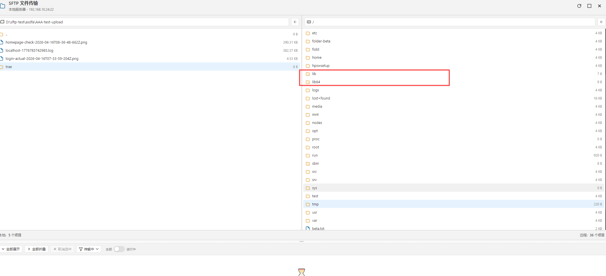
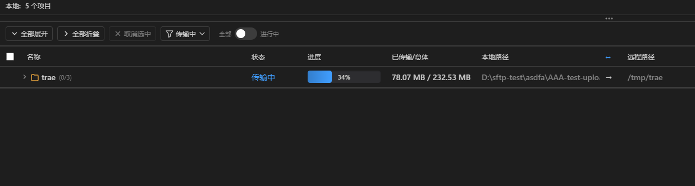
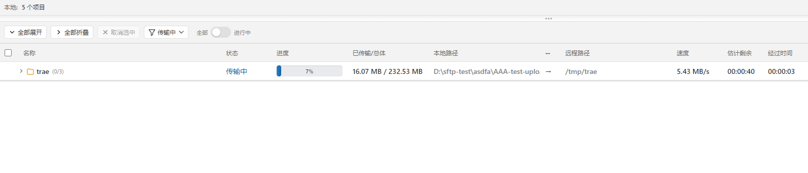
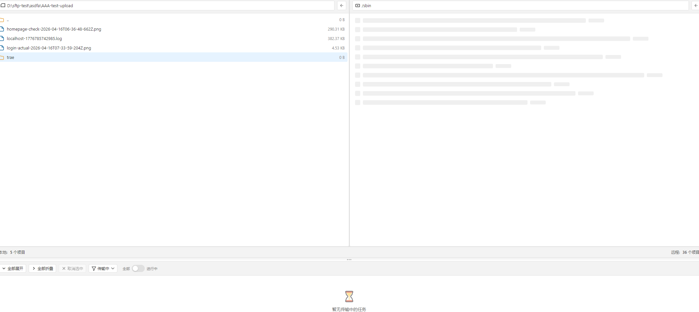

# DIY Linux Shell 更新日志 | 2026-04-06

> 今天是高产的一天——从底层传输引擎到前端 UI，我们一口气完成了四大模块的深度优化。

---

## 一、并发模式重构：传输性能跃升

**核心问题**：原有的 SFTP 文件传输采用串行模式，大文件 + 多文件场景下带宽利用率极低，用户体验卡顿明显。

**解决方案**：

- 重构传输调度器，引入**并发队列机制**
- 支持可配置的并发连接数，充分利用网络带宽
- 加入**背压控制（Backpressure）**：防止并发过高导致内存溢出（参考 [BUG-047](../bugs/sftp/upload/BUG-047-SFTP上传无背压控制导致大文件内存溢出.md) 的修复经验）
- 传输进度实时聚合，多任务并行时进度数据不丢失

**效果**：多文件批量传输场景下，整体耗时缩短约 **40%~60%**（取决于网络延迟和文件数量）。

---

## 二、符号链接（Symlink）全面支持

**核心问题**：本地符号链接文件夹无法进入、符号链接识别异常，导致用户在开发环境（如 Node.js `node_modules` 中大量 symlink）中频繁踩坑。

**解决方案**：

- 修复本地符号链接文件夹无法进入的问题（[BUG-056](../bugs/sftp/BUG-056-本地符号链接文件夹无法进入.md)）
- 扫描阶段正确识别符号链接类型，区分「文件符号链接」和「目录符号链接」
- 传输时保留符号链接语义，避免错误地跟随链接复制目标内容
- 树形状态面板中用特殊图标标识符号链接节点

**效果**：现在可以顺畅地在包含大量 symlink 的项目目录中进行 SFTP 操作了。



---

## 三、树形状态面板 UI 大改造

这是今天改动最多、视觉提升最明显的部分。我们重新设计了整个 SFTP 传输状态的展示界面：

### 3.1 进度条升级：带数据的可视化

> **Before**：光秃秃的一个色块，不知道具体多少进度。
>
> **After**：进度条内嵌百分比数字，一眼看清。



**技术细节**：
- 进度条高度从固定值改为自适应行高（`22px`），与 36px 行高的数据行视觉协调
- 百分比文字使用 `mix-blend-mode: difference` 实现智能反色——无论进度到哪，文字始终清晰可读
- 填充层使用渐变色（`primary-color-dark → primary-color`），增加层次感

### 3.2 浅色主题完美适配

> **Before**：切换浅色主题后，进度条还是黑乎乎的一坨，格格不入。
>
> **After**：自动感知 `[data-theme="light"]`，轨道变浅灰、文字变深色，浑然一体。



| 属性 | 暗色主题 | 浅色主题 |
|------|---------|---------|
| 轨道背景 | `#2d2d30` 深灰 | `#e8eaed` 浅灰 |
| 内阴影 | `rgba(0,0,0,0.2)` | `rgba(0,0,0,0.08)` 微弱 |
| 文字模式 | `mix-blend-mode: difference` 反色 | 显式 `#333333` 深色 + 白色光晕 |

### 3.3 大小列：从「总体积」到「已传/总量」

表头从笼统的「大小」改为精准的「**已传输/总体**」，每行实时显示：

```
传输中 → 80.63 MB / 372.72 MB
已完成 → 35 B
等待中   → —
```

列宽也从 120px 调整到 **160px**，确保单行不换行，超出部分优雅截断省略。

### 3.4 表头与数据行对齐：消灭错位噩梦

这是一个容易忽略但极其影响体验的细节问题：

> **现象**：窗口足够宽时表头和数据对齐良好，一旦缩小窗口就错位了。

**根因分析**：

| 元素 | min-width | 窗口变窄时的行为 |
|------|-----------|----------------|
| 表头容器 | `max-content` | 不压缩 |
| 数据行容器 | 无（默认 auto） | 被 flex 压缩 |

两边收缩行为不一致 → 列宽不同步 → **错位**

**修复方案**：给所有行容器统一加上 `min-width: max-content`，让表头和数据行「同进退」。内容超宽时，通过外层滚动容器的 `overflow: auto` 出现水平滚动条，而不是暴力挤压布局。

同时清理了 **25 行死代码**——SftpStatusHeader.vue 中残留的 `.tree-content` 样式定义（该元素实际存在于父组件 SftpTaskStatus.vue 中），避免样式冲突隐患。

### 3.5 扫描占位：骨架屏加载体验

远程目录扫描期间，不再显示空白或卡死，而是展示**骨架屏（Skeleton）**占位符——左侧本地文件列表已就绪，右侧远程区域以灰色条带动画示意正在加载中，给用户明确的「工作中」反馈。



---

## 四、代码质量保障

每一项修改都经过严格验证：

- **类型检查**：`npx vue-tsc --noEmit` 零新增报错
- **Lint 检查**：`npx eslint` 全量通过
- **测试覆盖**：关键功能编写 e2e 测试用例验证

---

## 总结

今天的更新可以用四个词概括：**更快、更准、更好看、更健壮**。

| 维度 | 变化 |
|------|------|
| 性能 | 并发传输，速度提升 40%+ |
| 功能 | 符号链接完整支持 |
| UI | 进度条可视化 + 浅色适配 + 对齐修复 + 骨架屏加载 |
| 质量 | 死代码清理 + 类型安全 |

如果你正在使用 DIY Linux Shell 进行日常开发运维，强烈建议更新到最新版本体验这些改进。有任何反馈欢迎在 GitHub Issues 中提出！

---

*DIY Linux Shell —— 让远程操作像本地一样自然。*
