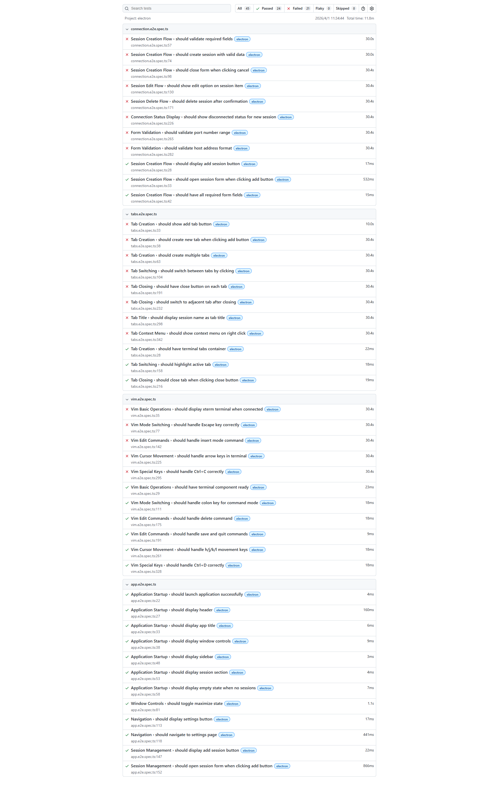
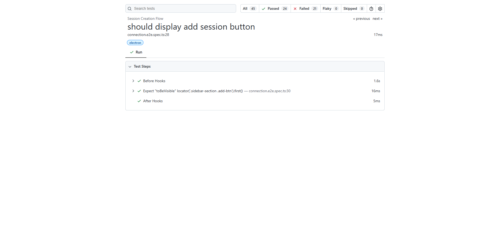
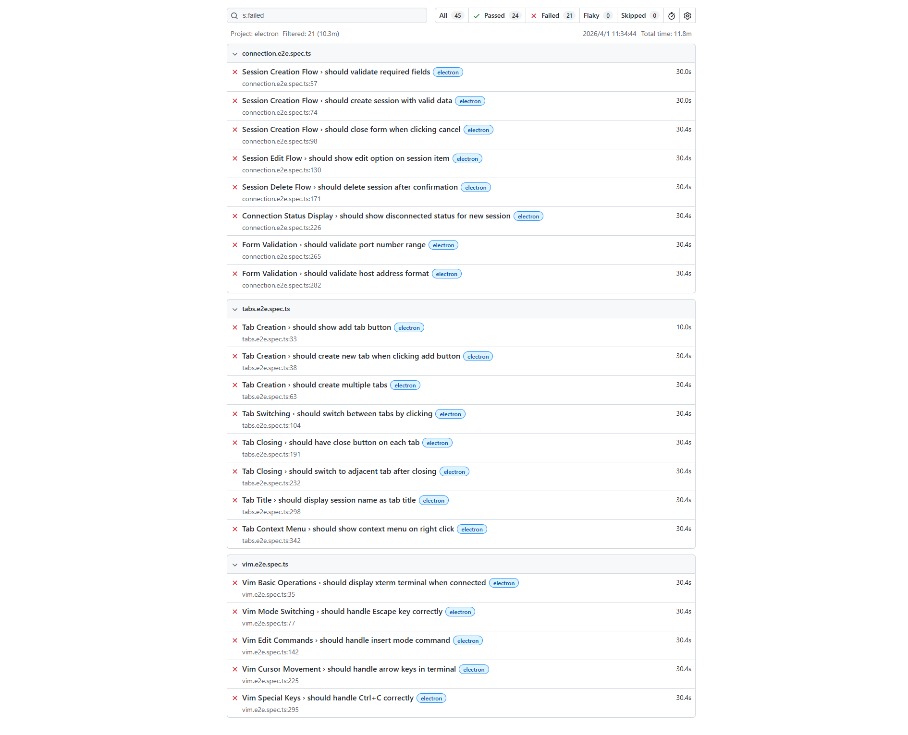

# E2E 测试结果预览

## 概述

本文档说明如何查看和理解 Playwright E2E 测试的结果报告。

## 测试报告生成

### 自动生成流程

当你运行 E2E 测试时，Playwright 会自动生成详细的测试报告：

```
npm run test:e2e
       │
       ▼
Playwright 执行测试用例
       │
       ▼
收集测试结果数据
       │
       ▼
生成 HTML 报告
       │
       ├── playwright-report/    (HTML 报告目录)
       │   ├── index.html        (报告主页面)
       │   ├── assets/           (样式和脚本资源)
       │   └── data/             (测试结果数据)
       │
       └── test-results/
           ├── results.json      (JSON 格式结果)
           └── */                (失败测试的截图等)
```

### 配置文件

测试报告的生成配置在 `playwright.config.ts` 中：

```typescript
export default defineConfig({
  // 报告器配置
  reporter: [
    ['html', { outputFolder: 'playwright-report' }],  // HTML 交互式报告
    ['json', { outputFile: 'test-results/results.json' }]  // JSON 数据
  ],
  
  // 失败时的附加信息
  use: {
    trace: 'on-first-retry',      // 重试时记录追踪
    screenshot: 'only-on-failure', // 仅失败时截图
    video: 'retain-on-failure'     // 保留失败视频
  }
})
```

## 查看测试报告

### 方式一：自动打开

测试完成后，Playwright 会自动启动本地服务器：

```
Serving HTML report at http://localhost:9323. Press Ctrl+C to quit.
```

在浏览器中访问 `http://localhost:9323/` 即可查看交互式测试报告。

### 方式二：手动打开

如果服务器已关闭，可以使用以下方式重新打开报告：

```bash
# 使用 Playwright 命令打开报告
npx playwright show-report

# 或者直接在浏览器中打开 HTML 文件
# 路径: playwright-report/index.html
```

### 方式三：指定端口

```bash
# 指定端口打开报告
npx playwright show-report --port 8080
```

## 报告界面说明

### 主界面

报告主界面包含以下信息：

| 区域 | 内容 |
|------|------|
| 顶部导航 | 项目名称、过滤选项、搜索框 |
| 左侧边栏 | 测试文件列表 |
| 主内容区 | 测试用例详情 |

**主界面截图**：



主界面展示了：
- **测试统计**: All (45)、Passed (24)、Failed (21)、Flaky (0)、Skipped (0)
- **测试文件**: connection.e2e.spec.ts、tabs.e2e.spec.ts、vim.e2e.spec.ts
- **执行时间**: 总耗时 11.8m
- **测试状态**: 每个测试用例的通过/失败状态和耗时

### 测试详情页面

点击具体测试用例可以查看详细信息：

**测试详情截图**：



详情页面包含：
- 测试名称和描述
- 执行时间
- 测试步骤
- 错误信息（如果失败）
- 截图和追踪（如果配置）

### 失败测试列表

可以通过顶部过滤按钮筛选失败的测试：

**失败测试截图**：



失败测试页面展示：
- 失败的测试用例列表
- 错误信息摘要
- 失败位置（文件名和行号）
- 执行耗时

| 图标 | 状态 | 说明 |
|------|------|------|
| ✅ | 通过 | 测试成功执行 |
| ❌ | 失败 | 测试执行失败 |
| ⏭️ | 跳过 | 测试被跳过 |
| 🔄 | 重试 | 测试经过重试 |

### 测试详情

点击具体测试用例可以查看：

1. **执行时间**: 测试运行耗时
2. **错误信息**: 失败测试的详细错误堆栈
3. **截图**: 失败时的页面截图
4. **执行追踪**: 详细的执行步骤追踪
5. **视频**: 失败时的录制视频（如果配置）

## 报告功能

### 过滤测试

可以使用顶部过滤按钮筛选：

- 仅显示失败的测试
- 仅显示通过的测试
- 仅显示跳过的测试

### 搜索测试

使用搜索框可以快速定位：

- 按测试文件名搜索
- 按测试用例名搜索
- 按错误信息搜索

### 查看时间线

报告显示每个测试的执行时间线：

```
测试开始
    │
    ├── 前置操作 (beforeEach)
    ├── 测试执行
    ├── 后置操作 (afterEach)
    │
测试结束
```

## 测试产物

### 失败截图

失败测试会自动截图，保存在：

```
test-results/
└── {测试名称}-electron/
    └── test-failed-1.png
```

### 执行追踪

追踪文件记录了测试执行的每一步：

```
test-results/
└── {测试名称}-electron/
    └── trace.zip
```

可以使用追踪查看器分析：

```bash
npx playwright show-trace trace.zip
```

### 视频录制

如果配置了视频录制，失败视频保存在：

```
test-results/
└── {测试名称}-electron/
    └── video.webm
```

## CI/CD 集成

### GitHub Actions

在 CI 环境中，可以上传测试报告作为构建产物：

```yaml
- name: Run E2E tests
  run: npm run test:e2e

- name: Upload test report
  uses: actions/upload-artifact@v3
  if: always()
  with:
    name: playwright-report
    path: playwright-report/
    retention-days: 30
```

### 多种报告格式

可以同时生成多种格式的报告：

```typescript
reporter: [
  ['html'],                           // HTML 报告（本地开发）
  ['json', { outputFile: 'results.json' }],  // JSON（数据处理）
  ['junit', { outputFile: 'junit.xml' }],    // JUnit（CI 集成）
  ['github']                          // GitHub Actions 注解
]
```

## 最佳实践

### 1. 报告保留策略

```typescript
// playwright.config.ts
use: {
  trace: 'on-first-retry',      // 仅重试时记录，节省空间
  screenshot: 'only-on-failure', // 仅失败时截图
  video: 'retain-on-failure'     // 仅保留失败视频
}
```

### 2. 测试命名规范

使用清晰的测试名称，便于在报告中识别：

```typescript
// 好的命名
test('should create session with valid data', async () => {})

// 不好的命名
test('test1', async () => {})
```

### 3. 测试分组

使用 `describe` 对测试进行分组：

```typescript
test.describe('Session Creation Flow', () => {
  test('should display add button', async () => {})
  test('should open form', async () => {})
  test('should validate fields', async () => {})
})
```

### 4. 添加注释

在测试中添加注释，报告中会显示：

```typescript
test('my test', async ({ page }) => {
  // 这是一个注释，会显示在报告中
  await page.click('.button')
})
```

## 常见问题

### Q: 报告页面无法打开？

A: 检查以下几点：
1. 确认 `playwright-report/` 目录存在
2. 确认 `index.html` 文件存在
3. 尝试使用 `npx playwright show-report` 命令

### Q: 如何分享测试报告？

A: 有几种方式：
1. 压缩 `playwright-report/` 目录发送给他人
2. 上传到静态文件服务器
3. 在 CI/CD 中作为构建产物上传

### Q: 报告文件太大怎么办？

A: 调整配置减少产物：
```typescript
use: {
  trace: 'off',           // 关闭追踪
  screenshot: 'off',      // 关闭截图
  video: 'off'            // 关闭视频
}
```

### Q: 如何查看历史测试结果？

A: 每次测试会覆盖之前的报告，如需保留历史：
1. 使用 CI/CD 构建产物功能
2. 手动备份 `playwright-report/` 目录
3. 使用 JSON 报告并存储到数据库

## 相关命令

| 命令 | 说明 |
|------|------|
| `npm run test:e2e` | 运行 E2E 测试并生成报告 |
| `npm run test:e2e:ui` | 使用 UI 模式运行测试 |
| `npm run test:e2e:debug` | 调试模式运行测试 |
| `npx playwright show-report` | 打开最近的测试报告 |
| `npx playwright show-trace <file>` | 查看追踪文件 |

## 参考资源

- [Playwright 官方文档 - Test Reporter](https://playwright.dev/docs/test-reporters)
- [Playwright 官方文档 - Trace Viewer](https://playwright.dev/docs/trace-viewer)
- 项目配置文件: [playwright.config.ts](../playwright.config.ts)
