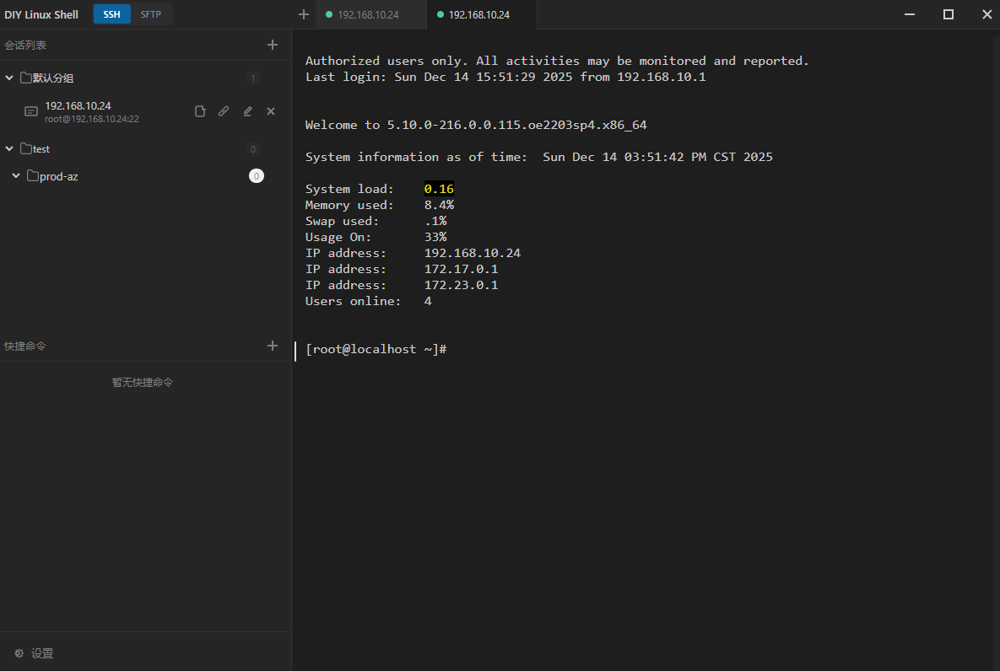
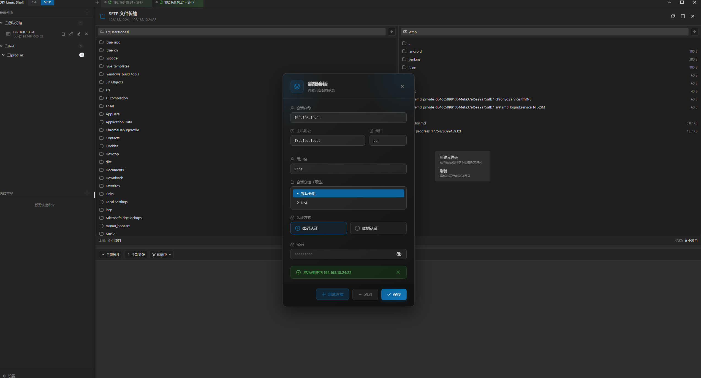
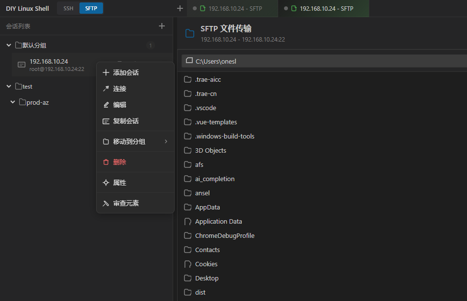
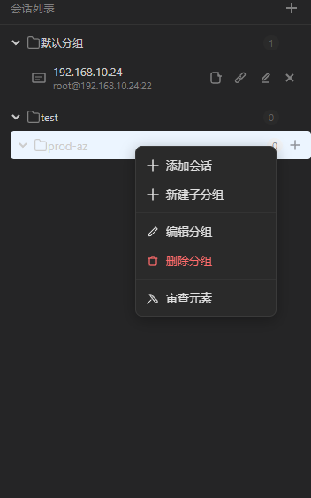
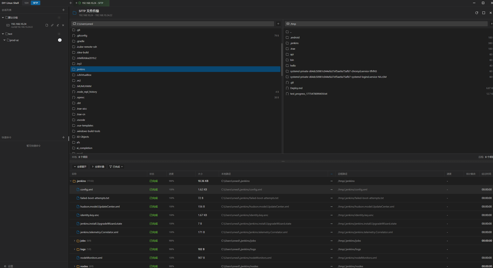
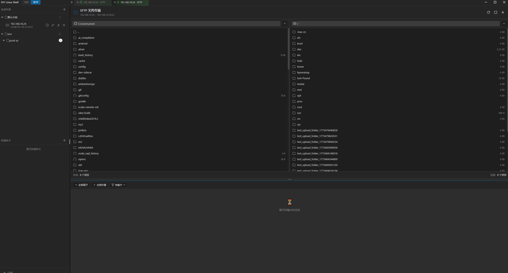

# 耗时一个月利用AI撸出一个仿制Xshell: Diy Linux Shell

最近一直在用AI捣鼓Shell远程工具，它可以像Xshell一样使用ssh执行命令、sftp上传下载文件。也可以通过对接大模型来执行自动化任务。

比如：帮我安装docker，并启动一个nginx。它就会使用大模型的能力来输出命令来安装docker和并自动启动容器版nginx。

## 开发过程记录

AI虽然是强大如斯，不过没有权限用到传说中牛皮Plus的CloudCode，用国内还可以的大模型Qwen、GLM 等也可以实现。它在写局部代码上是王者，在全局上相对可以，但是也是改了一个bug，又产生了新的bug。

这好家伙就跟打地鼠一样，导致我磨磨唧唧一个月了，才开发出ssh/sftp基础可用的版本。

所以你得指定项目规则，把AI给按住了按流程走：

这是我的项目流程：

1. 查看phase对应prd和plan。
2. 编写代码实现功能、编写必要的注释；
3. 根据electron-testing SKILL编写测试用例，验证新增功能是否正常,应确保新增、更改编写的测试用例代码全部通过；
4. 修复bug，将bug记录docs/bugs文件夹。

## DIY Linux Shell UI界面

1. 类似xshell的多tab界面，用户可以在不同的tab中执行不同的命令。
2. 支持会话分组，存储不同服务器的用户名、密码、端口号等信息。

### SSH
多ssh tab页：

### 会话分组支持

编辑会话：

### SFTP

支持多tab页Sftp功能、点击可以切换ssh/sftp模式：

这个界面和xshell的xftp1不一样,DIY Linux Shell UI是集成到一起的。

传输任务树形显示：

sftp多tab页：

基础的功能基本完成，后续要完成灵魂功能：接入大模型，解放双手了，敬请期待。