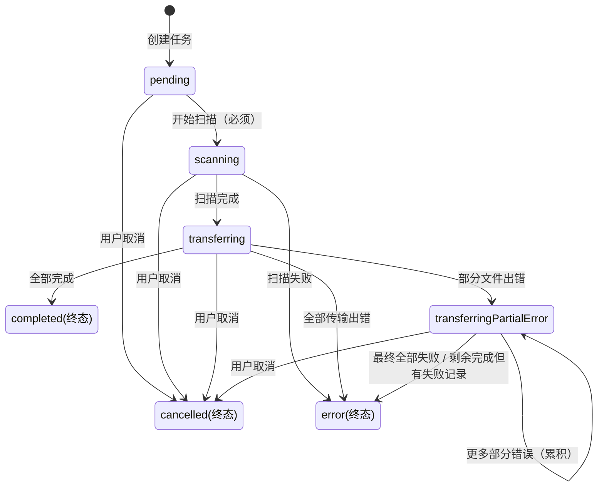
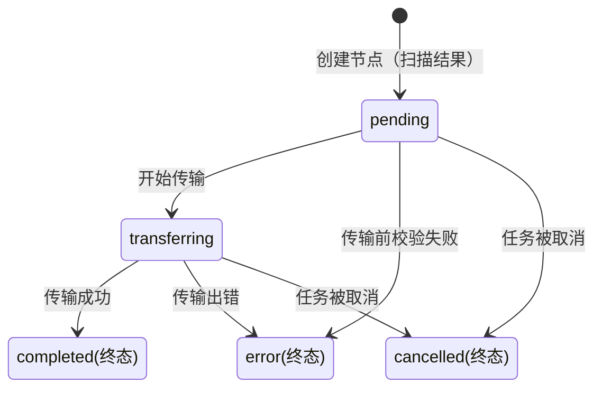

# SFTP 传输状态机

## 概述

本项目包含**两套独立的状态机**，分别管理不同粒度的状态流转：

| 状态机 | 管理对象 | 实现文件 | 状态数 |
|--------|---------|---------|:------:|
| **Task FSM** | 传输任务（整个上传/下载/删除批次） | `fsm/TaskStateMachine.ts` | 7 |
| **Node FSM** | 传输节点（单个文件/文件夹） | `fsm/NodeStateMachine.ts` | 5 |

## Mermaid 绘图规范

本项目所有状态机 Mermaid 图必须遵循以下规范：

1. **终态标注方式**：终态直接在节点名称后用括号文字标注，如 `completed(终态)`、`error(终态)`。**禁止使用单独的 `note` 框来标注"终态，不可逆"`，避免浪费空间。
2. **状态命名**：使用 camelCase，与代码中的字符串字面量一致。
3. **转换标签**：简明扼要说明触发条件。

---

# 一、任务状态机 (Task FSM)

## Mermaid 图



## 状态定义（7 个）

类型定义位于 `src/shared/types/sftp.ts` → `TransferStatus`

| 状态 | 类型 | 说明 |
|------|:----:|------|
| `pending` | 中间态 | 任务已创建，等待开始扫描 |
| `scanning` | 中间态 | 正在扫描（所有任务都必须经过此阶段） |
| `transferring` | 中间态 | 正在传输中，所有子节点正常 |
| `transferringPartialError` | 中间态 | 部分文件出错，其余仍在传输。**一旦进入不可到达 completed** |
| `completed`(终态) | **终态** | 全部成功完成，不可逆 |
| `error`(终态) | **终态** | 全部失败，不可逆 |
| `cancelled`(终态) | **终态** | 用户取消，不可逆 |

## 核心规则

```
pending → scanning → transferring ─┬→ completed(终态)   ← 唯一成功路径
                                  ├→ error(终态)        ← 全部失败
                                  ├→ transferringPartialError ← 部分出错
                                  └── cancelled(终态)

transferringPartialError ────────┬→ error(终态)         ← 必然结果（已有失败记录）
                               ├→ transferringPartialError (累积更多错误)
                               └── cancelled(终态)
```

**关键设计**：
- `transferringPartialError → completed` **被禁止** — 已有文件失败，不算"全部成功"
- `error` 为真正终态，不可转为 cancelled
- 所有任务必须经过 scanning，不允许 pending → transferring

## 合法转换矩阵（7×7）

> *partialErr = transferringPartialError*

| from \ to | **pending** | **scanning** | **transferring** | **partialErr** | **completed**(终态) | **error**(终态) | **cancelled**(终态) |
|:---------:|:-----------:|:------------:|:-----------------:|:--------------:|:-------------------:|:---------------:|:-------------------:|
| **pending** | ❌ | ✅ | ❌ *(禁止跳过扫描)* | ❌ | ❌ | ❌ | ✅ |
| **scanning** | ❌ | ❌ | ✅ | ❌ | ❌ | ✅ | ✅ |
| **transferring** | ❌ | ❌ | ❌ | ✅ | ✅ | ✅ | ✅ |
| **partialErr** | ❌ | ❌ | ❌ | ✅ *(累积)* | ❌ *(有失败记录)* | ✅ | ✅ |
| **completed** | ❌ | ❌ | ❌ | ❌ | ❌ | ❌ | ❌ |
| **error** | ❌ | ❌ | ❌ | ❌ | ❌ | ❌ | ❌ |
| **cancelled** | ❌ | ❌ | ❌ | ❌ | ❌ | ❌ | ❌ |

---

# 二、节点状态机 (Node FSM)

## Mermaid 图



## 状态定义（5 个）

类型定义位于 `src/shared/types/sftp.ts` → `NodeStatus`（独立于 `TransferStatus`）

| 状态 | 类型 | 说明 |
|------|:----:|------|
| `pending` | 中间态 | 节点已创建（扫描产物），等待开始传输 |
| `transferring` | 中间态 | 正在传输中 |
| `completed`(终态) | **终态** | 传输成功 |
| `error`(终态) | **终态** | 传输出错 |
| `cancelled`(终态) | **终态** | 任务被取消 |

### 节点为何没有 scanning 和 transferringPartialError

- **无 `scanning`**：scanning 是任务级操作。节点由扫描结果直接创建为 `pending`，不经历 scanning 阶段。
- **无 `transferringPartialError`**：这是任务级的聚合概念。对于单个节点（文件或文件夹），部分失败就是全部失败 — 节点只有 `error`。当一个任务的多个节点中部分 error、部分 completed 时，**任务**才进入 `transferringPartialError` 状态。

## 合法转换矩阵（5×5）

| from \ to | **pending** | **transferring** | **completed**(终态) | **error**(终态) | **cancelled**(终态) |
|:---------:|:-----------:|:-----------------:|:-------------------:|:---------------:|:-------------------:|
| **pending** | ❌ | ✅ | ❌ | ✅ | ✅ |
| **transferring** | ❌ | ❌ | ✅ | ✅ | ✅ |
| **completed** | ❌ | ❌ | ❌ | ❌ | ❌ |
| **error** | ❌ | ❌ | ❌ | ❌ | ❌ |
| **cancelled** | ❌ | ❌ | ❌ | ❌ | ❌ |

---

# 三、Task FSM 与 Node FSM 的关系

```
Task (任务)                          Node (节点)
┌─────────────────────────┐         ┌─────────────┐
│  pending                │         │  pending     │
│    ↓                    │         │    ↓         │
│  scanning               │  包含 N 个 │ transferring │
│    ↓                    │◄────────►│    ↓ ↓ ↓     │
│  transferring           │  节点聚合 │  c / e / c  │
│    ↓ ↓                  │         └─────────────┘
│  c / pE / e             │
└─────────────────────────┘

聚合规则:
- 所有节点 completed       → Task → completed
- 任一节点 error + 其余完成 → Task → transferringPartialError → error
- 所有节点 error           → Task → error
- 用户取消                 → Task → cancelled (所有节点也 → cancelled)
```

| 场景 | Task 终态 | 条件 |
|------|----------|------|
| 全部成功 | `completed` | 所有节点均为 completed |
| 部分失败 | `error` | 经由 `transferringPartialError`，最终到 error |
| 全部失败 | `error` | 所有节点均为 error |
| 用户取消 | `cancelled` | 用户主动取消 |

---

# 四、Bug 记录

### BUG: 取消任务仍显示已完成

**现象**: 用户点击"取消选中"后，任务仍然出现在"已完成"筛选下。

**根因**: 异步竞态 — cancel 后后台异步回调覆盖了 cancelled。

**修复方案**: 引入 FSM 终态保护，三处入口统一调用守卫。

**相关测试用例**: （待补充 e2e 测试）

---

# 五、与功能模块的对应关系

| 功能模块 | Task FSM 转换 | Node FSM 转换 | 相关测试用例 |
|---------|--------------|---------------|------------|
| 上传 | pending→scanning→transferring→终态 | pending→transferring→终态 | |
| 下载 | 同上 | 同上 | |
| 删除 | 同上 | 同上 | |
| 取消任务 | non-terminal→cancelled | non-terminal→cancelled | |
