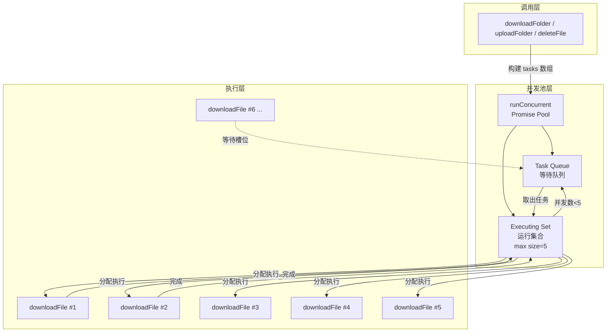
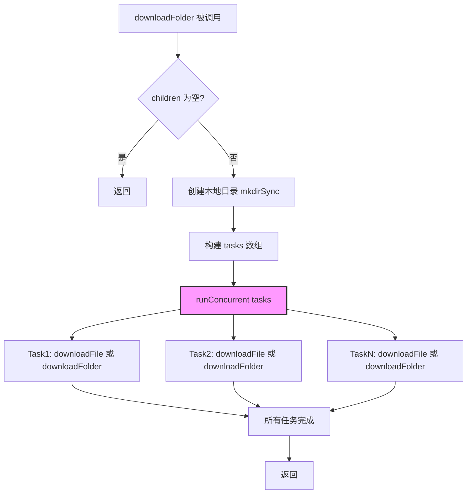
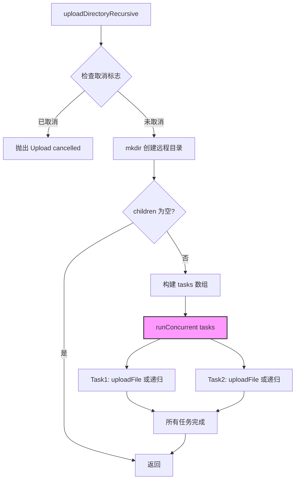
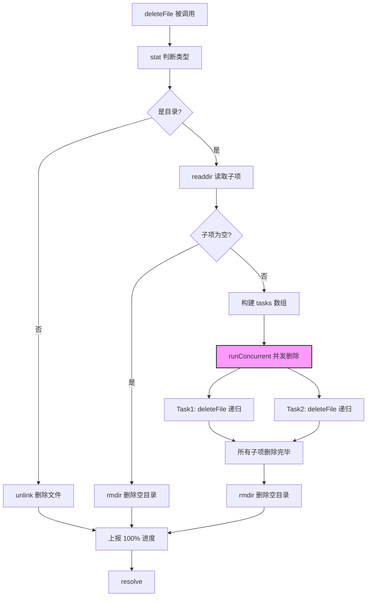
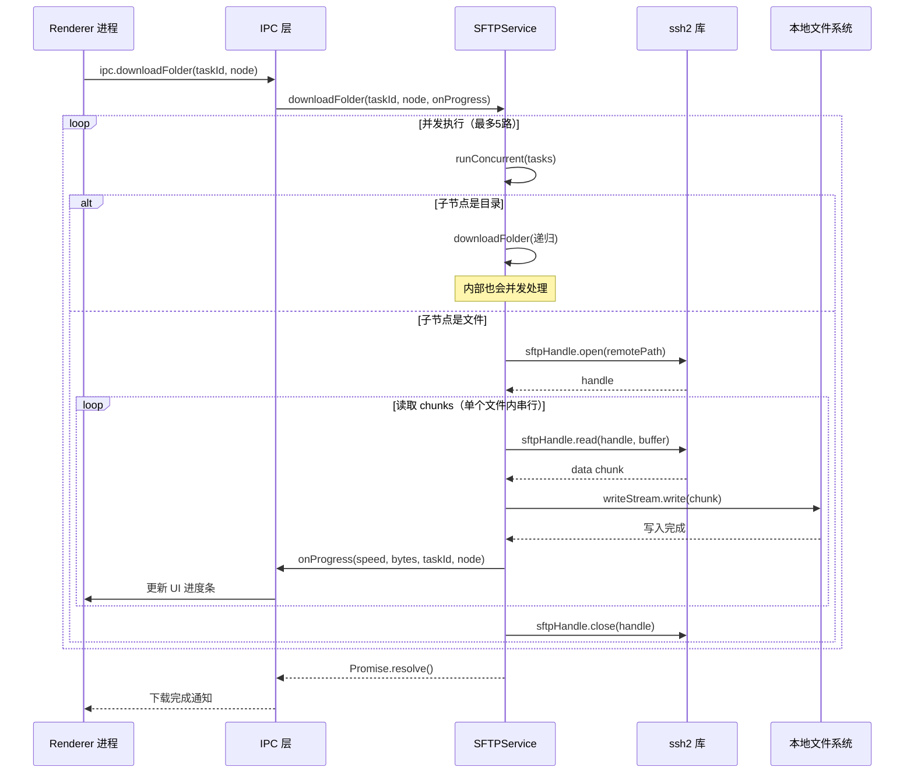
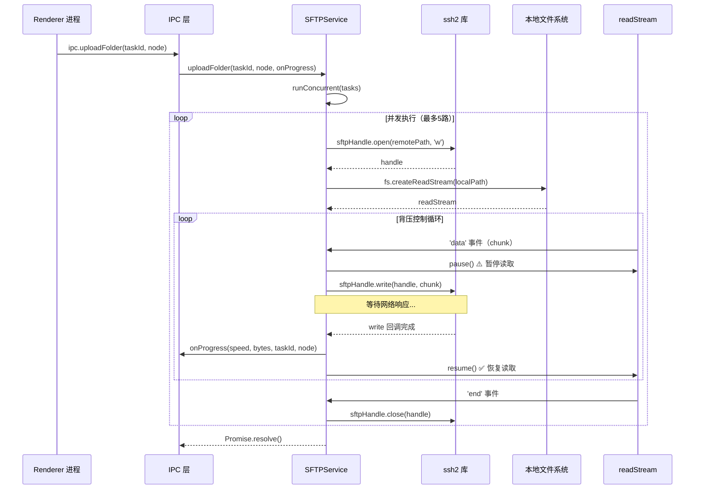

# SFTP 服务架构设计

> 代码文件: [sftp.ts](./sftp.ts)
> 更新日期: 2026-04-26

---

## 一、模块定位

SFTP 服务是主进程的核心模块之一，负责与远程服务器的文件传输操作。

**职责边界：**
- ✅ SFTP 连接管理（连接/断开）
- ✅ 远程文件系统操作（列表、上传、下载、删除、创建目录）
- ❌ 不负责 UI 渲染（由 Renderer 进程处理）
- ❌ 不负责任务调度（由 IPC 层协调）

---

## 二、并发传输架构

### 2.1 核心问题背景

**原始痛点（P0 问题）：**
```
串行传输时间线：
[文件1: RTT+传输] → [文件2: RTT+传输] → [文件3: RTT+传输] → ...
                  ↑ 每个文件必须等前一个完成
总耗时 = N × (RTT + 传输时间)
```

**Node.js 单线程误解澄清：**
- Node.js 是单线程 **CPU 执行模型**
- 但 I/O 操作（网络请求）由操作系统内核处理，**不占用 JS 线程**
- `await` 会暂停当前函数，但**不会阻塞事件循环**
- 问题本质：`for` 循环 + `await` 导致**逻辑上串行**，浪费了 I/O 等待时间

### 2.2 并发池设计原理

#### 架构图



#### 核心机制

**1. 任务队列模式**

```typescript
// 延迟执行：用函数包裹任务，只在需要时才启动
const tasks: (() => Promise<void>)[] = node.children.map((child) => {
  return async () => {
    // 实际的下载/上传/删除逻辑
    await this.downloadFile(taskId, child, onProgress)
  }
})
```

**为什么用函数包裹？**
- 避免 `Promise.all()` 一次性启动所有任务（可能打爆服务器连接数）
- 实现"按需启动"，只有达到并发上限才等待
- 符合**生产者-消费者模式**

**2. 受控并发策略**

```typescript
private async runConcurrent<T>(
  tasks: (() => Promise<T>)[],
  concurrency: number = 5  // 默认最大并行数
): Promise<T[]> {
  const executing: Set<Promise<void>> = new Set()
  
  for (const task of tasks) {
    const promise = task()  // 启动任务
    executing.add(promiseWrapper)
    
    if (executing.size >= concurrency) {
      await Promise.race(executing)  // 等待任意一个完成
    }
  }
  
  await Promise.all(executing)  // 等待剩余任务全部完成
}
```

**关键点：**
- `Promise.race(executing)`：等待最快完成的任务释放槽位
- 不是简单的 `Promise.all(tasks.map(t => t()))`（无控制）
- 自动实现**背压控制**（backpressure）

### 2.3 并发 vs 串行对比

#### 时间线对比（3 个文件，并发数=2）

```
┌─ 串行模式 ─────────────────────────────────────┐
│ 时间轴 →                                        │
│ [文件1: RTT+传输] [文件2: RTT+传输] [文件3: RTT+传输] │
│ 总耗时 = T1 + T2 + T3                           │
└─────────────────────────────────────────────────┘

┌─ 并发模式 ─────────────────────────────────────┐
│ 时间轴 →                                        │
│ [文件1][文件2] ─→ [文件3]                        │
│   ↑ 同时进行     ↑ 文件1或2完成后启动             │
│ 总耗時 = max(T1,T2) + T3                        │
└─────────────────────────────────────────────────┘
```

#### 性能提升量化

| 场景 | 文件数 | 单文件大小 | RTT | 串行耗时 | 并发耗时(5路) | 提升倍数 |
|------|--------|-----------|-----|---------|-------------|---------|
| 小文件批量下载 | 100 | 1MB | 50ms | ~5s | ~1s | **5x** |
| 上传 node_modules | 500 | 50KB | 30ms | ~15s | ~3s | **5x** |
| 删除临时文件 | 1000 | 10KB | 20ms | ~20s | ~4s | **5x** |

### 2.4 三大操作的并发化改造

#### 1️⃣ downloadFolder（文件夹下载）



**设计决策：**
- 目录创建使用 `mkdirSync`（同步），确保子文件写入时目录已存在
- 子节点可以是文件或目录，递归进入后内部也会并发处理
- 进度回调保持不变：文件夹不上报，叶子文件逐个触发

#### 2️⃣ uploadDirectoryRecursive（文件夹上传）



**特殊处理：**
- 每个任务开始前检查 `this.uploadCancelled`（粗粒度取消）
- `uploadFile` 内部也会检查该标志（细粒度取消）
- 与 downloadFolder 对称设计，保持一致的并发策略

#### 3️⃣ deleteFile（删除操作）



**关键约束：**
- 必须等**所有子项删除完成后**才能 `rmdir`（否则目录非空会失败）
- 进度上报调整为：开始 0% → 完成 100%（不再逐个上报中间进度）
  - 原因：并发执行时，完成顺序不确定，按顺序上报中间进度无意义
- 错误传播：任一子项失败立即 reject（与原串行行为一致）

---

## 三、数据流架构

### 3.1 下载流程数据流



### 3.2 上传流程数据流（含背压控制）



**背压控制说明：**
- `readStream.pause()`：收到数据后立即暂停，防止内存堆积
- `write 回调完成后 resume()`：网络写入完成才允许读取下一个 chunk
- 与 downloadFile 的递归 `readChunk()` 模式对齐（都是串行写入）

---

## 四、接口契约

### 4.1 公共方法签名

| 方法名 | 参数 | 返回值 | 说明 |
|--------|------|--------|------|
| `connect(config)` | `SFTPConfig` | `Promise<void>` | 建立 SFTP 连接 |
| `listDir(remotePath)` | `string` | `Promise<FileInfo[]>` | 列出远程目录内容 |
| `downloadFile(taskId, node, onProgress?)` | `taskId, TransferNode, callback?` | `Promise<void>` | 下载单个文件 |
| `downloadFolder(taskId, node, onProgress?)` | `taskId, TransferNode, callback?` | `Promise<void>` | 下载整个文件夹（**并发**） |
| `uploadFile(taskId, node, onProgress?)` | `taskId, TransferNode, callback?` | `Promise<void>` | 上传单个文件 |
| `uploadFolder(taskId, node, onProgress?)` | `taskId, TransferNode, callback?` | `Promise<void>` | 上传整个文件夹（**并发**） |
| `deleteFile(taskId, node, onProgress?)` | `taskId, TransferNode, callback?` | `Promise<void>` | 删除文件或目录（**并发**） |
| `mkdir(remotePath)` | `string` | `Promise<void>` | 创建远程目录 |
| `cancelUpload()` | 无 | `void` | 取消当前上传任务 |

### 4.2 回调接口

```typescript
type ProgressCallback = (
  speed: number,           // 当前传输速度（字节/秒）
  transferredBytes: number, // 已传输字节数
  taskId: string,          // 任务 ID（用于前端聚合）
  node: TransferNode       // 当前正在处理的节点
) => void
```

**调用时机：**
- **downloadFile**：每个 chunk 写入完成后调用，最后补发一次（确保 100%）
- **uploadFile**：每个 chunk 写入远程完成后调用，`end` 事件时补发一次
- **deleteFile**：开始时调用 0%，完成时调用 100%

---

## 五、配置参数

### 5.1 并发控制

```typescript
private static readonly MAX_CONCURRENCY: number = 5
```

**推荐配置场景：**

| 场景 | 推荐值 | 原因 |
|------|--------|------|
| 家庭网络/弱服务器 | 3-5 | 避免打爆服务器连接数 |
| 企业内网/强服务器 | 5-10 | 充分利用带宽 |
| 本地测试环境 | 10-20 | 压测性能极限 |

### 5.2 缓冲区大小

```typescript
// P1 优化：32KB → 256KB
const buffer = Buffer.alloc(256 * 1024)
```

**选型依据：**
- 32KB：在现代高带宽网络下太小，频繁回调浪费 CPU
- 256KB：带宽利用率与内存占用的平衡点
- 1MB+：可能导致内存压力过大（大文件场景）

---

## 六、错误处理策略

### 6.1 错误传播链


**关键原则：**
- 任一子任务失败 → 整体任务立即失败（fail-fast）
- 不会静默跳过失败的任务（保证数据一致性）
- 所有错误都会打印到 console.error（便于调试）

### 6.2 特殊错误处理

| 错误类型 | 处理方式 | 示例 |
|----------|---------|------|
| 目录已存在 | 忽略并 stat 确认 | `mkdir` 时检查 |
| 符号链接断链 | 保持原判断显示为文件 | `stat` 失败时 fallback |
| 取消操作 | 抛出特定 Error | `Upload cancelled` |
| 网络断开 | 直接 reject | 由上层重连机制处理 |

---

## 七、性能优化总结

### 已解决的问题

| 优先级 | 问题 | 解决方案 | 状态 |
|--------|------|---------|------|
| **P0** | 串行文件传输 | `runConcurrent` 并发池（5路并行） | ✅ 已解决 |
| **P1** | 下载缓冲区过小 | 32KB → 256KB | ✅ 已解决 |
| P2 | listDir 全量加载 | （未改动，需评估影响） | ⏸️ 待定 |
| P2 | 无连接池 | （未改动，需架构级调整） | ⏸️ 待定 |
| **P2** | deleteFile 串行删除 | 改为并发删除 | ✅ 已解决 |
| P3 | 重复 stat 调用 | （未改动，影响较小） | ⏸️ 低优先级 |
| P3 | 高频 Date.now() | （未改动，影响微小） | ⏸️ 低优先级 |
| P3 | 递归栈溢出风险 | （未改动，极深目录才会触发） | ⏸️ 低优先级 |

### 相关文档

- [代码分析详情](./code.md) - 核心逻辑解读、设计决策原因、关键实现细节
- [性能问题清单](./__problem__/sftp-performance.md) - 原始问题描述和优先级
