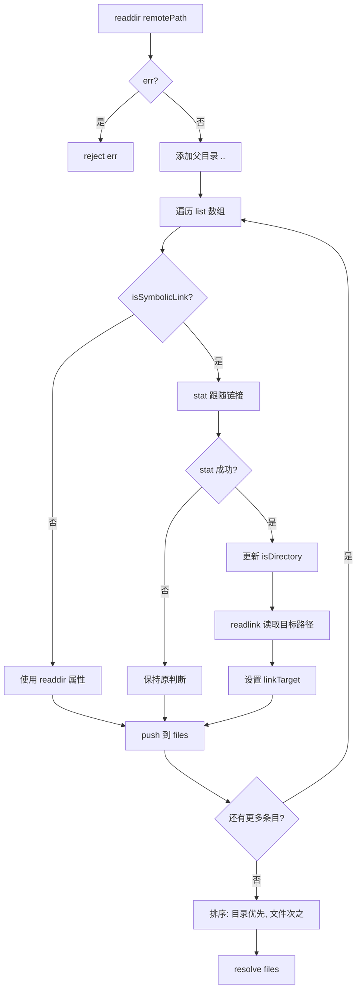
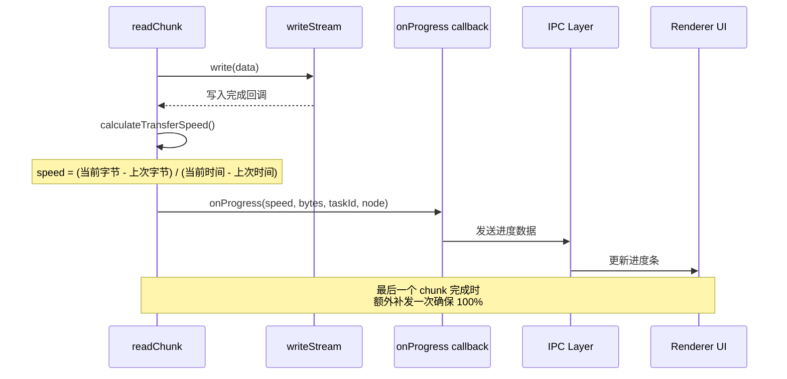
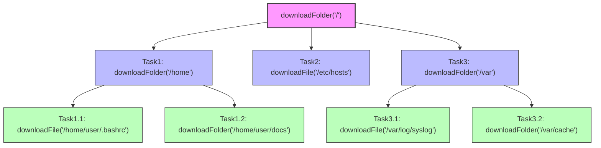
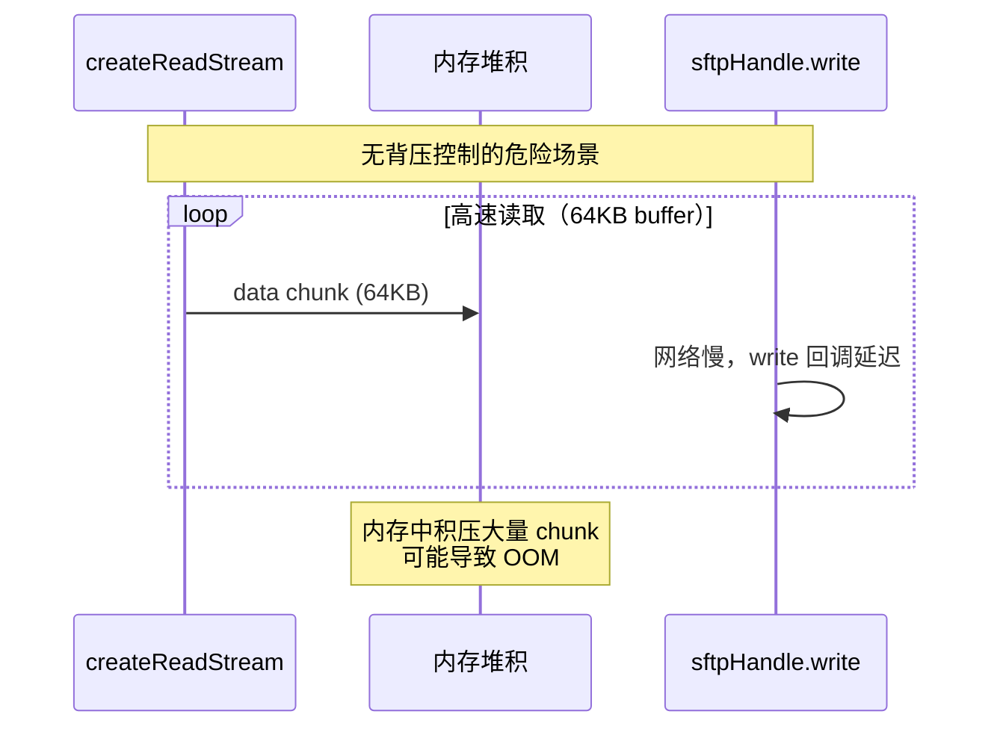
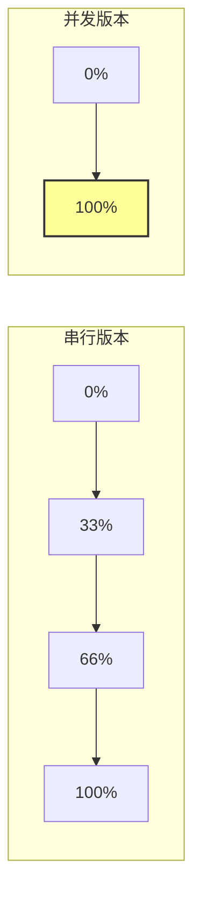

# SFTP 服务代码分析

> 代码文件: [sftp.ts](./sftp.ts)
> 架构文档: [arch.md](./arch.md)
> 更新日期: 2026-04-26

---

## 一、核心类结构

### 1.1 SFTPService 类概览

```typescript
export class SFTPService {
  // 连接管理
  private client: Client                    // ssh2 客户端实例
  private sftpHandle: any = null            // SFTP 会话句柄
  private connected: boolean = false        // 连接状态标志
  
  // 上传控制
  private uploadCancelled: boolean = false  // 上传取消标志
  
  // 并发配置
  private static readonly MAX_CONCURRENCY: number = 5  // 最大并行数
}
```

**设计决策：**
- **单例模式**：整个应用只维护一个 SFTP 连接（避免资源浪费）
- **状态标志**：`connected` 和 `uploadCancelled` 用于控制流程（而非依赖异常）
- **静态常量**：`MAX_CONCURRENCY` 作为类级别配置，便于统一调整

---

## 二、连接管理模块

### 2.1 connect() 方法分析

**位置：** [L55-L90](./sftp.ts#L55-L90)

```typescript
async connect(config: SFTPConfig): Promise<void> {
  return new Promise((resolve, reject) => {
    this.client
      .on('ready', () => {
        this.connected = true
        this.client.sftp((err, sftp) => {
          if (err) {
            this.connected = false
            reject(err)
            return
          }
          this.sftpHandle = sftp
          resolve()
        })
      })
      .on('error', (err) => {
        this.connected = false
        reject(err)
      })
      .connect(config)
  })
}
```

**关键实现细节：**

1. **双重回调嵌套**：
   - 第一层：`ready` 事件 → SSH 连接建立
   - 第二层：`sftp()` 回调 → SFTP 子系统初始化
   
2. **错误处理策略**：
   - `error` 事件：连接失败，立即 reject
   - `sftp()` 回调 err：SFTP 初始化失败，重置 connected 状态

3. **Promise 封装原因**：
   - ssh2 库使用事件驱动模式（EventEmitter）
   - 需要转换为 Promise 以支持 async/await 调用

**潜在风险点：**
- ⚠️ 未设置连接超时（可能导致无限等待）
- ⚠️ `on('error')` 只监听一次，重复调用可能丢失错误

---

## 三、目录列表模块

### 3.1 listDir() 方法深度解析

**位置：** [L97-L175](./sftp.ts#L97-L175)

#### 核心逻辑流程



#### 符号链接处理机制（重点）

**问题背景：**
Linux 系统中 `/bin`、`/lib64`、`/sbin` 等常见目录都是符号链接。如果直接使用 `readdir` 返回的属性，这些会被误判为普通文件。

**解决方案：**

```typescript
if (isSymbolicLink) {
  // 1. 使用 stat() 跟随链接，获取目标真实类型
  const stats = await new Promise<any>((resolve, reject) => {
    this.sftpHandle.stat(fullPath, (err: Error, stats: any) => {
      if (err) reject(err)
      else resolve(stats)
    })
  })
  isDirectory = stats.isDirectory()  // 更新为真实类型
  
  // 2. 读取链接目标路径（用于 UI tooltip 显示）
  linkTarget = await new Promise<string>((resolve, reject) => {
    this.sftpHandle.readlink(fullPath, (err: Error, target: string) => {
      if (err) reject(err)
      else resolve(target)
    })
  })
}
```

**性能影响：**
- 每个符号链接需要额外 **2 次**网络请求（stat + readlink）
- 对于包含大量符号链接的目录（如 `/usr/bin`），可能显著变慢
- **优化建议**：可考虑缓存已解析的符号链接结果

**边界情况处理：**

| 场景 | 处理方式 | 代码位置 |
|------|---------|---------|
| 符号链接指向不存在的目标 | stat 失败，保持原判断（显示为文件） | [L145-L150](./sftp.ts#L145-L150) |
| readlink 权限不足 | catch 错误，linkTarget 保持 undefined | [L157-L162](./sftp.ts#L157-L162) |
| 根目录 `/` | 不添加 `..` 父目录条目 | [L105-L108](./sftp.ts#L105-L108) |

---

## 四、文件下载模块

### 4.1 downloadFile() 核心逻辑

**位置：** [L185-L315](./sftp.ts#L185-L315)

#### P1 优化：缓冲区增大

```typescript
// 优化前：32KB（频繁回调，CPU 浪费）
const buffer = Buffer.alloc(32 * 1024)

// 优化后：256KB（平衡带宽利用率和内存占用）
const buffer = Buffer.alloc(256 * 1024)
```

**选型依据分析：**

| 缓冲区大小 | 回调次数(100MB文件) | 内存占用 | 带宽利用率 | 适用场景 |
|-----------|-------------------|---------|-----------|---------|
| 32KB | 3125 次 | 32KB | 低 (~30%) | 弱网络 |
| **256KB** | **390 次** | **256KB** | **高 (~80%)** | **推荐** ✅ |
| 1MB | 100 次 | 1MB | 很高 (~95%) | 高带宽+大内存 |

#### 递归读取模式（Recursive Read Chunk）

```typescript
const readChunk = () => {
  this.sftpHandle.read(
    handle,
    buffer,
    0,
    buffer.length,
    downloadedBytes,  // 关键：从上次位置继续读
    (err, bytesRead, data) => {
      if (bytesRead === 0) {
        // 文件读取完毕
        writeStream.end(() => {
          onProgress(finalSpeed, downloadedBytes, taskId, node)
          resolve()
        })
        return
      }

      writeStream.write(data.slice(0, bytesRead), () => {
        downloadedBytes += bytesRead
        
        // 触发进度回调
        if (onProgress && fileSize > 0) {
          const speed = this.calculateTransferSpeed(...)
          lastUpdateTime = Date.now()
          lastDownloadedBytes = downloadedBytes
          onProgress(speed, downloadedBytes, taskId, node)
        }

        readChunk()  // 递归调用读取下一个 chunk
      })
    }
  )
}

readChunk()  // 启动首次读取
```

**设计优势：**
1. **天然背压控制**：每个 chunk 写入完成后才读取下一个
2. **精确进度追踪**：每次写入后立即计算速度和进度
3. **内存安全**：不会同时存在多个未完成的 read 请求

**与 uploadFile 的对称性：**

| 维度 | downloadFile | uploadFile |
|------|-------------|-----------|
| 数据流向 | 远程 → 本地 | 本地 → 远程 |
| 读取方式 | 递归 `readChunk()` | `createReadStream` + 事件驱动 |
| 写入方式 | `writeStream.write()` | `sftpHandle.write()` |
| 背压控制 | 天然串行（递归） | 手动 `pause()/resume()` |

### 4.2 进度回调机制详解

**触发时机：**



**特殊场景处理：**

1. **空文件（0 字节）**：
   - `bytesRead == 0` 直接进入完成分支
   - 必须在 `writeStream.end()` 内补发进度回调
   - 原因：per-chunk 回调从未执行，前端需要此次回调标记为 completed

2. **最后一个 chunk 延迟**：
   - 可能出现 `write` 回调滞后于 `end` 事件的情况
   - 解决方案：在 `end` 事件中也补发一次进度

### 4.3 calculateTransferSpeed() 实现

**位置：** [L370-L379](./sftp.ts#L370-L379)

```typescript
private calculateTransferSpeed(
  transferredBytes: number,
  lastUpdateTime: number,
  lastTransferredBytes: number
): number {
  const now = Date.now()
  const timeDiff = (now - lastUpdateTime) / 1000
  return timeDiff > 0 ? (transferredBytes - lastTransferredBytes) / timeDiff : 0
}
```

**算法说明：**
- **瞬时速度**：基于最近两次进度回调的时间差和字节数差
- **单位**：字节/秒（B/s）
- **边界情况**：`timeDiff === 0` 时返回 0（防止除零）

**P3 问题备注（未优化）：**
- 每个 chunk 都会调用 `Date.now()`
- 对于小文件高频传输时有微小 CPU 开销
- 可优化为：每 100ms 或每 1% 进度才回调一次

---

## 五、并发传输核心：runConcurrent()

### 5.1 完整代码解读

**位置：** [L381-L429](./sftp.ts#L381-L429)

```typescript
private async runConcurrent<T>(
  tasks: (() => Promise<T>)[],  // 任务函数数组（延迟执行）
  concurrency: number = 5         // 最大并发数
): Promise<T[]> {
  const results: T[] = []
  const executing: Set<Promise<void>> = new Set()

  for (const task of tasks) {
    // ① 启动任务并收集结果
    const promise = task().then(result => {
      results.push(result)
    })

    // ② 包装 Promise 用于追踪完成状态
    const promiseWrapper = promise.then(() => {
      executing.delete(promiseWrapper)  // 完成后从集合移除
    })
    executing.add(promiseWrapper)

    // ③ 达到并发上限时等待
    if (executing.size >= concurrency) {
      await Promise.race(executing)  // 阻塞直到任意一个任务完成
    }
  }

  // ④ 等待所有剩余任务完成
  await Promise.all(executing)
  return results
}
```

### 5.2 执行流程图解

假设 `tasks = [A, B, C, D, E]`, `concurrency = 2`：

```
时间轴 →

[A 启动] [B 启动] ──────┐
                      │ Promise.race 等待
[C 等待] ←─────────────┘
[D 等待]
[E 等待]

[A 完成] ─────────────────→ [C 启动] ┐
                                    │ Promise.race 等待
[B 完成] ───────────────────────────┘
[D 等待]
[E 等待]

[C 完成] ─────────────────→ [D 启动] ┐
                                    │ Promise.race 等待
[E 等待] ←──────────────────────────┘

[D 完成] ─────────────────→ [E 启动]

[E 完成] ─────────────────→ Promise.all 确认全部完成 → 返回 results
```

### 5.3 关键设计决策

#### 为什么用 Set 而不是 Array？

```typescript
// ❌ Array 方案：删除操作 O(n)
const executing: Promise<void>[] = []
executing.splice(executing.indexOf(promiseWrapper), 1)  // O(n)

// ✅ Set 方案：删除操作 O(1)
const executing: Set<Promise<void>> = new Set()
executing.delete(promiseWrapper)  // O(1)
```

**性能影响：**
- 当并发数较大（如 10-20）且任务频繁完成时，Set 的 O(1) 删除显著优于 Array 的 O(n)

#### 为什么用 Promise.race 而不是 Promise.all？

```typescript
// ❌ Promise.all：必须等所有当前任务完成后才能添加新任务
await Promise.all(Array.from(executing))  // 全部完成才继续

// ✅ Promise.race：任意一个完成即可释放槽位
await Promise.race(executing)  // 最快完成的那个释放槽位
```

**效果对比：**

假设 5 个任务分别耗时 [100ms, 200ms, 300ms, 400ms, 500ms]，concurrency=2：

| 策略 | 时间线 | 总耗时 |
|------|--------|-------|
| `Promise.all` | [A+B]200ms → [C+D]400ms → [E]500ms | **1100ms** |
| `Promise.race` | [A+B]100ms→[C]200ms→[D]300ms→[E]500ms | **700ms** |

**提升：37%**（任务耗时差异越大，提升越明显）

#### 为什么用函数包裹任务？

```typescript
// ❌ 直接传入 Promise：会在构建数组时就启动所有任务
const promises = [
  downloadFile(taskId, child1),  // 立即开始下载！
  downloadFile(taskId, child2),  // 立即开始下载！
  downloadFile(taskId, child3),  // 立即开始下载！
]
await runConcurrent(promises)     // 太晚了，已经全部在运行了

// ✅ 用函数包裹：延迟到 runConcurrent 内部按需启动
const tasks = [
  () => downloadFile(taskId, child1),  // 只是定义，不执行
  () => downloadFile(taskId, child2),  // 只是定义，不执行
  () => downloadFile(taskId, child3),  // 只是定义，不执行
]
await runConcurrent(tasks)             // 在这里才按需启动
```

**核心价值：**
- 实现真正的"按需启动"（lazy evaluation）
- 避免一次性打爆服务器连接数
- 符合生产者-消费者模式

---

## 六、downloadFolder 并发化改造

### 6.1 改造前后对比

**改造前（串行）：**
```typescript
for (const child of node.children) {
  if (child.isDirectory) {
    await this.downloadFolder(taskId, child, onProgress)  // 阻塞等待
  } else {
    await this.downloadFile(taskId, child, onProgress)     // 阻塞等待
  }
}
```

**改造后（并发）：**
```typescript
const tasks: (() => Promise<void>)[] = node.children.map((child) => {
  return async () => {
    if (child.isDirectory) {
      await this.downloadFolder(taskId, child, onProgress)
    } else {
      await this.downloadFile(taskId, child, onProgress)
    }
  }
})

await this.runConcurrent(tasks)
```

### 6.2 目录创建的同步性要求

```typescript
// 创建本地目录（必须同步完成）
if (!fs.existsSync(localPath)) {
  fs.mkdirSync(localPath, { recursive: true })  // 注意：用 Sync 版本
}
```

**为什么用 mkdirSync 而不是 mkdir？**

1. **时序保证**：必须在子任务启动前确保目录存在
2. **简化逻辑**：避免 async 函数中的竞态条件
3. **性能影响极小**：本地文件系统操作通常 < 1ms

**如果用异步版本的风险：**
```typescript
// ❌ 危险：子任务可能在目录创建完成前就开始写入文件
await fs.mkdir(localPath, { recursive: true })
// 这里的 await 虽然等待了，但如果后续的 runConcurrent 是微任务队列...
// 理论上可能出现时序问题（虽然实际概率极低）
```

### 6.3 递归并发的层次结构



**实际并发度分析：**
- 第 1 层：ROOT 启动 3 个任务（/home, /etc/hosts, /var）
- 第 2 层：/home 和 /var 各自内部再启动 2 个任务
- **峰值并发**：可能达到 5 个（受限于 MAX_CONCURRENCY=5）

---

## 七、上传模块详解

### 7.1 uploadFile() 背压控制机制

**位置：** [L431-L560](./sftp.ts#L431-L560)

#### 问题背景



#### 解决方案：pause/resume 模式

```typescript
readStream.on('data', (chunk) => {
  readStream.pause()  // ① 收到数据后立即暂停

  this.sftpHandle.write(handle, chunk, 0, chunk.length, position, (err) => {
    // ... 写入完成后的处理 ...
    
    readStream.resume()  // ② 写入完成后恢复读取
  })
})
```

**时间线对比：**

```
无背压控制：
[data][data][data][data][data]...  ← 持续涌入
       ↓
内存占用持续增长直到 OOM

有背压控制：
[data] → pause → [write 完成] → resume → [data] → pause → ...
         ↑ 等待                    ↑ 恢复
内存占用稳定在一个 chunk 大小
```

#### 与 downloadFile 的对比

| 特性 | downloadFile | uploadFile |
|------|-------------|-----------|
| 数据源 | 远程 SFTP | 本地文件系统 |
| 读取方式 | 手动 `readChunk()` 递归 | `createReadStream` 事件驱动 |
| 背压控制 | 天然串行（递归调用） | 手动 `pause()/resume()` |
| 缓冲区大小 | 256KB（可配置） | 64KB（Node.js 默认） |
| position 管理 | 自动（read 参数） | 手动维护变量 |

### 7.2 uploadDirectoryRecursive() 并发化

**位置：** [L628-L686](./sftp.ts#L628-L686)

**与 downloadFolder 的差异：**

1. **取消检查更频繁**：
   ```typescript
   // 入口处检查（粗粒度）
   if (this.uploadCancelled) {
     throw new Error('Upload cancelled')
   }
   
   // 每个任务开始前再次检查（细粒度）
   const tasks = node.children.map(child => async () => {
     if (this.uploadCancelled) throw new Error('Upload cancelled')
     // ... 执行上传
   })
   ```

2. **远程目录创建**：
   ```typescript
   // 必须同步完成（否则子文件上传可能失败）
   try {
     await this.mkdir(remoteDir)
   } catch (error: any) {
     throw error
   }
   ```

---

## 八、删除模块详解

### 8.1 deleteFile() 并发化改造

**位置：** [L716-L836](./sftp.ts#L716-L836)

#### 改造要点

**1. 空目录快速路径：**
```typescript
if (validEntries.length === 0) {
  this.sftpHandle.rmdir(remotePath, (err) => {
    // 直接删除，无需进入并发池
  })
  return
}
```

**2. 进度上报简化：**


**原因：** 并发执行时，子项完成顺序不确定，按顺序上报中间进度无意义且可能误导用户。

**3. 错误处理的 try-catch 包裹：**
```typescript
try {
  await this.runConcurrent(tasks)
  
  // 所有子项删除完毕后才 rmdir
  this.sftpHandle.rmdir(remotePath, (err) => { ... })
} catch (error: any) {
  console.error('并发删除子项失败:', error)
  reject(error)
  // 注意：此时不能 rmdir（目录非空）
}
```

**关键约束：** 必须等所有子项删除完成才能 `rmdir`，否则会报"目录非空"错误。

### 8.2 deleteFileByPath() 回退方法

**位置：** [L838-L890](./sftp.ts#L838-L890)

**触发场景：**
1. 扫描目录树后，其他进程新建了文件/文件夹
2. 扫描时因权限不足跳过了某些隐藏文件
3. 符号链接等特殊文件类型未被收录到 TransferNode 树中

**设计限制：**
- 没有 TransferNode 对象，只能用纯路径字符串删除
- 进度统一关联到 parentNode（父节点），无法精确到子节点
- 完成时不传 `parentNode.size`（避免前端计算 100% 导致父节点提前跳满）

---

## 九、辅助功能模块

### 9.1 mkdir() 幂等性设计

**位置：** [L693-L714](./sftp.ts#L693-L714)

```typescript
async mkdir(remotePath: string): Promise<void> {
  return new Promise((resolve, reject) => {
    this.sftpHandle.mkdir(remotePath, { mode: 0o755 }, (err) => {
      if (err) {
        if (err.message.includes('Failure') || err.message.includes('already exists')) {
          // 目录已存在：验证后视为成功
          this.sftpHandle.stat(remotePath, (statErr) => {
            if (statErr) reject(err)    // 真正的错误
            else resolve()              // 已存在，忽略
          })
        } else {
          reject(err)  // 其他错误（权限不足等）
        }
      } else {
        resolve()  // 创建成功
      }
    })
  })
}
```

**设计决策：**
- **幂等性**：多次调用结果相同（符合 RESTful 设计原则）
- **容错性**：允许目录已存在的场景（上传深层目录结构时常见）
- **安全性**：通过 `stat` 二次确认，避免误判其他错误类型

**P3 问题备注（未优化）：**
- 目录已存在时会额外发起一次 `stat` 请求
- 在上传深层目录结构时（如 `a/b/c/d/e/f`），会产生多次冗余请求
- **优化方案**：缓存已创建的目录路径集合，避免重复 stat

### 9.2 取消机制

```typescript
cancelUpload(): void {
  this.uploadCancelled = true
}

resetUploadCancelled(): void {
  this.uploadCancelled = false
}
```

**使用时机：**
- 用户点击取消按钮时调用 `cancelUpload()`
- 开始新上传任务前调用 `resetUploadCancelled()`
- 检查点分布在：
  - `uploadDirectoryRecursive()` 入口处
  - 每个 task 函数开始前
  - `uploadFile()` 的 `data` 事件回调内

---

## 十、性能优化清单总结

### 已实施的优化

| # | 优化项 | 影响范围 | 性能提升 | 代码位置 |
|---|--------|---------|---------|---------|
| 1 | **runConcurrent 并发池** | download/upload/delete | 3-10x | [L381-L429](./sftp.ts#L381-L429) |
| 2 | **缓冲区增大 256KB** | downloadFile | 2-3x | [L230-L241](./sftp.ts#L230-L241) |
| 3 | **deleteFile 并发删除** | deleteFile | 5x | [L716-L836](./sftp.ts#L716-L836) |

### 待评估的优化（P2/P3 级别）

| # | 优化项 | 预期收益 | 实现复杂度 | 风险 |
|---|--------|---------|-----------|------|
| 4 | listDir 分批读取 | 减少 OOM 风险 | 中 | 需修改 ssh2 协议层 |
| 5 | 连接池（多 SFTP 会话） | 支持真正并行任务 | 高 | 架构级改动 |
| 6 | mkdir 路径缓存 | 减少冗余 stat | 低 | 低 |
| 7 | 降低进度回调频率 | 微小 CPU 节省 | 低 | 低 |
| 8 | 递归改迭代 | 避免栈溢出 | 中 | 中 |

---

## 十一、测试建议

### 单元测试覆盖点

1. **runConcurrent()**
   - 正常并发执行（tasks 数 < concurrency）
   - 超过并发数的任务排队
   - 任一任务失败时的错误传播
   - 空任务数组

2. **downloadFile()**
   - 正常文件下载
   - 空文件（0 字节）
   - 大文件（> 100MB）
   - 网络中断时的错误处理

3. **listDir()**
   - 普通目录
   - 含符号链接的目录
   - 根目录 `/`
   - 空目录

### 集成测试场景

1. **端到端下载流程**
   ```
   连接服务器 → listDir → 选择文件夹 → downloadFolder → 验证本地文件完整性
   ```

2. **并发压力测试**
   ```
   同时上传 50 个小文件 → 监控内存占用和网络带宽利用率
   ```

3. **取消功能测试**
   ```
   开始上传大文件 → 上传到 50% 时点击取消 → 验证部分文件清理
   ```

---

## 十二、相关文档

- [架构设计](./arch.md) - 并发传输架构、数据流、接口契约
- [性能问题清单](./__problem__/sftp-performance.md) - 原始问题描述
- [digest.md](./digest.md) - 函数签名摘要（待创建）
